# Part 1: Reasoning RL Assignment

## Problem `math_baseline`: Zero-Shot MATH Baseline (4 points)

### (a)
**Question:** Write a script to evaluate Qwen 2.5 Math 1.5B zero-shot performance on MATH. This script should (1) load the MATH validation examples from `/data/a5-alignment/MATH/validation.jsonl`, (2) format them as string prompts to the language model using the `r1_zero` prompt, and (3) generate outputs for each example. This script should also (4) calculate evaluation metrics and (5) serialize the examples, model generations, and corresponding evaluation scores to disk for analysis in subsequent problems.

**Deliverable:** A script to evaluate baseline zero-shot MATH performance.

### (b)
**Question:** Run your evaluation script on Qwen 2.5 Math 1.5B. How many model generations fall into each of the following categories: (1) correct with both format and answer reward 1, (2) format reward 1 and answer reward 0, (3) format reward 0 and answer reward 0? Observing at least 10 cases where format reward is 0, do you think the issue is with the base model's output, or the parser? Why? What about in (at least 10) cases where format reward is 1 but answer reward is 0?

**Deliverable:** Commentary on the model and reward function performance, including examples of each category.

**Answer:** Because the official course MATH validation set was unavailable in our
self-hosted environment, we ran this analysis on the converted
`competition_math_numeric` MATH-like validation set. Out of 3,199 generations,
104 had both `format_reward = 1` and `answer_reward = 1`, 459 had
`format_reward = 1` and `answer_reward = 0`, and 2,636 had both rewards equal
to 0. We archived the summary and sampled examples under
`artifacts/experiments/main/ch3/3_2_math_baseline/`; the run summary is archived in
`artifacts/experiments/main/ch3/3_2_math_baseline/run_summaries_archive.md` and
`artifacts/experiments/main/ch3/3_2_math_baseline/run_summaries.json`; the raw run
data are archived under `artifacts/experiments/main/ch3/3_2_math_baseline/runs/`.

In the inspected `format_reward = 0` examples, the main issue was usually model
behavior under the strict R1-Zero output protocol rather than a vLLM failure.
Many responses contained relevant mathematical reasoning, and sometimes even
the correct numeric answer, but failed the exact parser format by using malformed
or nonstandard tags, omitting `</think>`, failing to close `</answer>`, or
writing an answer outside the required `</think> <answer> ... </answer>`
pattern. For example, some sampled generations used `<end think>` instead of
`</think>`, wrote `<answer>` without a closing `</answer>`, or produced the
correct boxed answer without any R1-Zero answer block. In the inspected
`format_reward = 1, answer_reward = 0` examples, the failures were mixed: some
were genuine reasoning errors, while others contained the correct value inside a
longer natural-language answer that the grader did not parse as equivalent to
the short ground-truth answer. Overall, this baseline suggests that the base
model can often reason in the right direction, but it is not reliable at
producing the strict answer format required by `r1_zero_reward_fn`.

### (c)
**Question:** How well does the Qwen 2.5 Math 1.5B zero-shot baseline perform on MATH?

**Deliverable:** 1-2 sentences with evaluation metrics.

**Answer:** Since the official course MATH validation set was unavailable in our
self-hosted environment, we report the zero-shot baseline on the converted
`competition_math_numeric` MATH-like validation set rather than the official
MATH validation set. On this substitute validation set, Qwen 2.5 Math 1.5B
achieved 3.25% reward accuracy, 17.60% format accuracy, and 3.25% answer
accuracy under the R1-Zero prompt with `r1_zero_reward_fn`.

---

## Problem `tokenize_prompt_and_output`: Prompt and Output Tokenization (2 points)

**Question:** Tokenize the prompt and output strings, and construct a mask that is 1 for the response tokens and 0 for other tokens (prompt or padding).

**Deliverable:** Implement a method `tokenize_prompt_and_output` that tokenizes the question and output separately, concatenates them together, and constructs a `response_mask`. The following interface is recommended: `def tokenize_prompt_and_output(prompt_strs, output_strs, tokenizer): Tokenize the prompt and output strings, and construct a mask that is 1 for the response tokens and 0 for other tokens (prompt or padding).` To test your code, implement `[adapters.run_tokenize_prompt_and_output]`. Then, run the test with `uv run pytest -k test_tokenize_prompt_and_output` and make sure your implementation passes it.

---

## Problem `compute_entropy`: Per-Token Entropy (1 point)

**Question:** Get the entropy of the next-token predictions (i.e., entropy over the vocabulary dimension).

**Deliverable:** Implement a method `compute_entropy` that computes the per-token entropy of next-token predictions. Note: you should use a numerically stable method (e.g., using `logsumexp`) to avoid overflow. To test your code, implement `[adapters.run_compute_entropy]`. Then run `uv run pytest -k test_compute_entropy` and ensure your implementation passes.

---

## Problem `get_response_log_probs`: Response Log-Probabilities and Entropy (2 points)

**Question:** Getting log-probabilities from a model. Obtaining log-probabilities from a model is a primitive that we will need in both SFT and RL. You will want to use a numerically stable method to compute this, and are free to use methods from `torch.nn.functional`. We also suggest including an argument to optionally compute and return token entropies.

**Deliverable:** Implement a method `get_response_log_probs` that gets per-token conditional log-probabilities (given the previous tokens) from a causal language model, and optionally the entropy of the model's next-token distribution. To test your code, implement `[adapters.run_get_response_log_probs]`. Then run `uv run pytest -k test_get_response_log_probs` and ensure the test passes.

---

## Problem `masked_normalize`: Masked Normalize (1 point)

**Question:** Sum over a dimension and normalize by a constant, considering only those elements where `mask == 1`.

**Deliverable:** Implement a method `masked_normalize` that sums over tensor elements and normalizes by a constant while respecting a boolean mask. To test your code, implement `[adapters.run_masked_normalize]`. Then run `uv run pytest -k test_masked_normalize` and ensure it passes.

---

## Problem `sft_microbatch_train_step`: SFT Microbatch Train Step (3 points)

**Question:** Execute a forward-and-backward pass on a microbatch.

**Deliverable:** Implement a single micro-batch update for SFT, including cross-entropy loss, summing with a mask, and gradient scaling. To test your code, implement `[adapters.run_sft_microbatch_train_step]`. Then run `uv run pytest -k test_sft_microbatch_train_step` and confirm it passes.

---

## Problem `log_generations`: Logging Generations (1 point)

**Question:** Logging generations in-the-loop. It’s always good practice to do some in-the-loop logging that involves generation from your model, and reasoning SFT/RL is no exception. Write a function `log_generations` that will prompt your model to generate responses for some given prompts (e.g., sampled from the validation set). It’s a good idea to log at least the following for each example: the input prompt, the response generated by the SFT/RL model, the ground-truth answer, the reward information, including format, answer, and total reward, the average token entropy of the response, and the average response length, average response length for correct responses, and average response length for incorrect responses.

**Deliverable:** Implement a function `log_generations` that can be used to log generations from your model.

---

## Problem `sft_experiment`: Run SFT on MATH (2 points, 2 H100 hrs)

### (1)
**Question:** Run SFT on the reasoning SFT examples (provided in `/data/a5-alignment/MATH/sft.jsonl`) using the Qwen 2.5 Math 1.5B base model, varying the number of unique examples for SFT in the range `{128, 256, 512, 1024}`, along with using the full dataset. Tune the learning rate and batch size to achieve at least 15% validation accuracy when using the full dataset.

**Deliverable:** Validation accuracy curves for different dataset sizes.

### (2)
**Question:** Filter the reasoning SFT examples to only include examples that produce the correct answer. Run SFT on the (full) filtered dataset and report the size of the filtered dataset and the validation accuracy you achieve. Compare your findings to the previous SFT experiment.

**Deliverable:** Report the size of the dataset and the validation accuracy curve you achieve.

**Answer:** The official `/data/a5-alignment/MATH` files were not available in
our self-hosted environment, so we ran this experiment on the converted
`competition_math_numeric` MATH-like substitute dataset. We used the noisy SFT
split from this substitute data for the dataset-size sweep, and used the reward
function to construct a filtered version for the second experiment. The reward
filter removed 730 of 4,866 examples, so the observed contamination rate in
this noisy SFT split was about 15.0%. All runs used Qwen2.5-Math-1.5B,
effective batch size 16, microbatch size 4, gradient accumulation 4, learning
rate `5e-5`, synchronous vLLM validation every 100 optimizer steps, and 900
optimizer steps total.

The validation accuracy curves for the SFT dataset-size sweep are shown below.

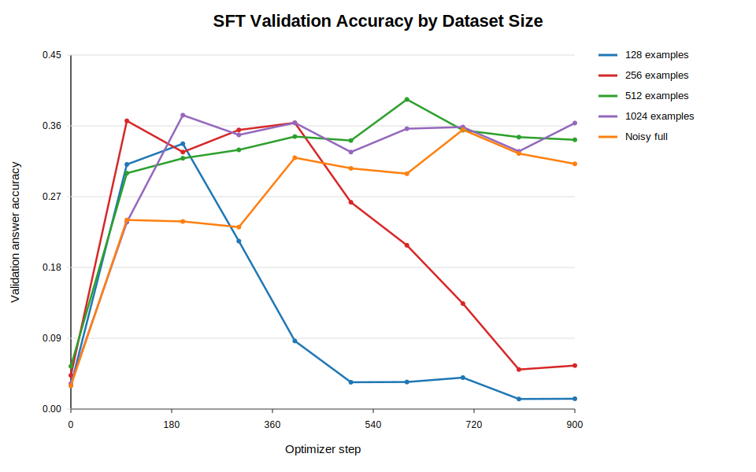

The run summaries used by this section are archived in
`artifacts/experiments/main/ch4/sft_experiment/run_summaries_archive.md` and
`artifacts/experiments/main/ch4/sft_experiment/run_summaries.json`; the raw per-run
data are archived under `artifacts/experiments/main/ch4/sft_experiment/runs/`.

The main results are:

| setting | train examples | effective epochs | best answer acc | best step | final answer acc | final step |
|---|---:|---:|---:|---:|---:|---:|
| 128 | 128 | 112.5 | 33.73% | 200 | 1.31% | 900 |
| 256 | 256 | 56.2 | 36.64% | 100 | 5.53% | 900 |
| 512 | 512 | 28.1 | 39.36% | 600 | 34.23% | 900 |
| 1024 | 1024 | 14.1 | 37.36% | 200 | 36.36% | 900 |
| Noisy full | 4866 | 3.0 | 35.51% | 700 | 31.17% | 900 |

All dataset sizes cleared the assignment's 15% target at some point in
training, including the full noisy dataset, which reached 35.51% validation
answer accuracy. The best peak in this sweep came from the 512-example run,
which reached 39.36% at step 600. However, the fixed 900-step budget makes the
small-data runs receive many more effective epochs than the full-data run, and
the 128- and 256-example runs collapsed badly by the end of training. Their
final answer accuracies fell to 1.31% and 5.53%, with format accuracies also
dropping sharply, which suggests that these tiny subsets were overfit so
aggressively that the model lost the validation-time response behavior needed
by the reward parser. In contrast, the 512-, 1024-, and full-data runs were
more stable at the end of training.

For the filtered SFT experiment, filtering retained 4,136 of the 4,866 noisy
SFT examples. The filtered-vs-noisy validation curve is shown below.

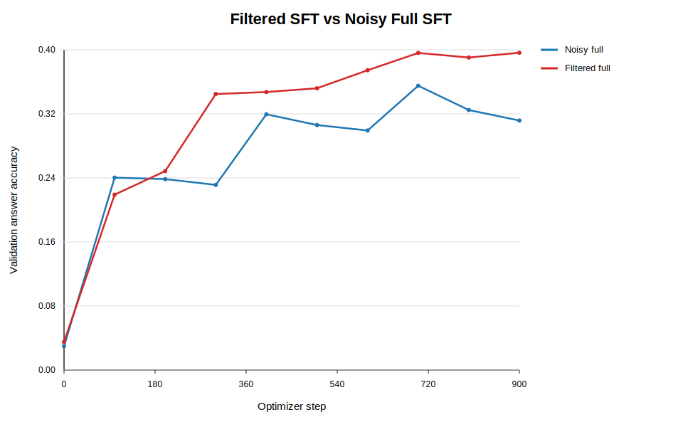

The comparison is:

| setting | train examples | best answer acc | best step | final answer acc | final step |
|---|---:|---:|---:|---:|---:|
| Noisy full | 4866 | 35.51% | 700 | 31.17% | 900 |
| Filtered full | 4136 | 39.64% | 900 | 39.64% | 900 |

Reward filtering improved the best validation answer accuracy by 4.13
percentage points, from 35.51% to 39.64%, and improved final validation answer
accuracy by 8.47 points, from 31.17% to 39.64%. The filtered curve was also
more stable late in training: unlike the noisy full run, whose accuracy peaked
at step 700 and then declined by step 900, the filtered full run achieved its
best score at the final checkpoint. This supports the filtering hypothesis in
the assignment: SFT traces whose final answers fail the reward function are
harmful enough that removing them produces a cleaner supervised warm start,
and makes late-training performance more stable.

The size-sweep results should be interpreted carefully because the optimizer
step budget was fixed across dataset sizes. Smaller datasets therefore receive
many more effective epochs than the full dataset: for example, the 128-example
run sees about 112.5 epochs, while the full noisy run sees only about 3.0.
Thus, the result does not imply that smaller datasets are inherently better;
rather, under this fixed-step budget, the small datasets fit quickly and then
can overfit or collapse, while the full noisy dataset learns more slowly but
maintains substantially better late-training validation behavior.

---

## Problem `expert_iteration_experiment`: Run Expert Iteration on MATH (2 points, 6 H100 hrs)

**Question:** Run expert iteration on the MATH dataset (provided at `/data/a5-alignment/MATH/train.jsonl`) using the Qwen 2.5 Math 1.5B Base model, varying the number of rollouts `G` per question and the number of epochs used in the SFT step, and using `n_ei_steps = 5`. Vary the batch size for each expert iteration step (i.e., the size of `D_b`) in `{512, 1024, 2048}`. You do not need to try all possible combinations of these hyperparameters. Just enough to draw conclusions about each is fine. Log the entropy of the model's responses over training. Make sure to have vLLM terminate generations at the second answer tag `</answer>`, as done in the SFT section.

**Deliverable:** Validation accuracy curves associated with different rollout configurations. Try at least 2 different rollout counts and epoch counts.

**Deliverable:** A model that achieves validation accuracy of at least 15% on MATH.

**Deliverable:** A brief 2 sentence discussion comparing to your SFT performance, as well as performance across EI steps.

**Deliverable:** A plot of the entropy of the model's responses over training.

**Answer:** Because the official course MATH files were not available in this
environment, we ran EI on the same substitute MATH-like
`competition_math_numeric_noisy` split used in the SFT experiments above.
Validation was run on the full 3199-example validation set with the R1-Zero
prompt, temperature 1.0, max tokens 1024, and the
`r1_zero_reward_fn`-based answer reward.

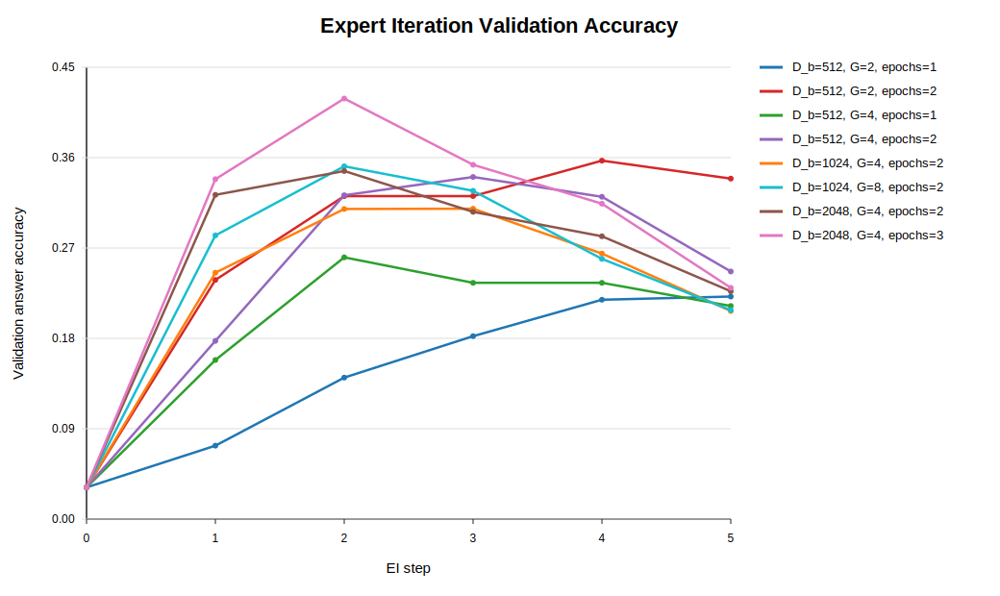

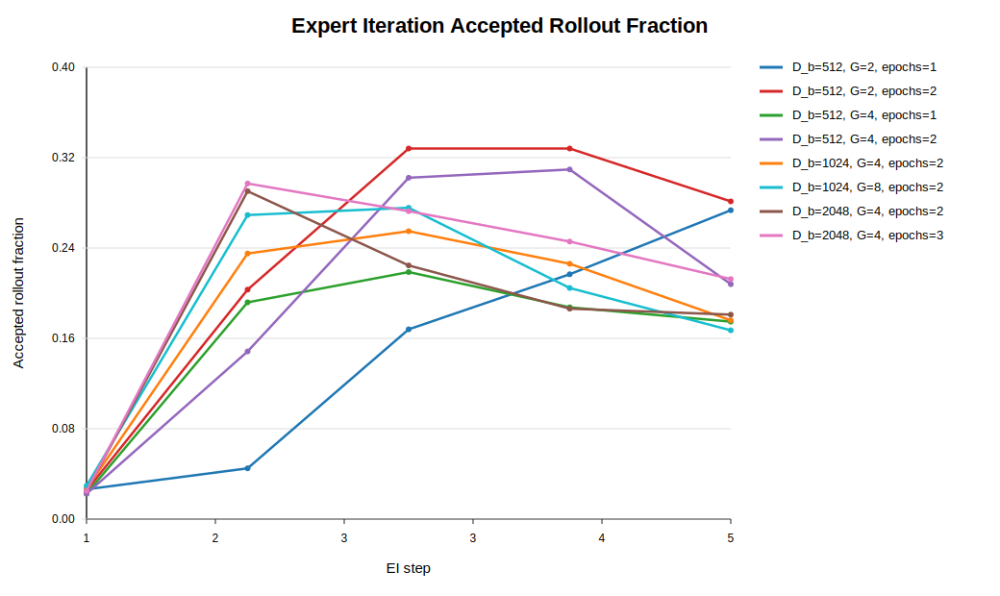

The run summaries used by this section are archived in
`artifacts/experiments/main/ch5/expert_iteration/run_summaries_archive.md` and
`artifacts/experiments/main/ch5/expert_iteration/run_summaries.json`; the raw
per-run data are archived under `artifacts/experiments/main/ch5/expert_iteration/runs/`.

The table below summarizes the EI runs.

| Configuration | Best answer accuracy | Best EI step | Final answer accuracy | Final EI step |
|---|---:|---:|---:|---:|
| `D_b=512, G=2, epochs=1` | 22.16% | 5 | 22.16% | 5 |
| `D_b=512, G=2, epochs=2` | 35.70% | 4 | 33.92% | 5 |
| `D_b=512, G=4, epochs=1` | 26.07% | 2 | 21.23% | 5 |
| `D_b=512, G=4, epochs=2` | 34.07% | 3 | 24.66% | 5 |
| `D_b=1024, G=4, epochs=2` | 30.92% | 3 | 20.73% | 5 |
| `D_b=1024, G=8, epochs=2` | 35.14% | 2 | 20.82% | 5 |
| `D_b=2048, G=4, epochs=2` | 34.67% | 2 | 22.69% | 5 |
| `D_b=2048, G=4, epochs=3` | **41.89%** | 2 | 23.04% | 5 |

The best EI configuration was `D_b=2048, G=4, epochs=3`, which reached
41.89% validation answer accuracy at EI step 2. This comfortably exceeds the
15% target, though this result is on the substitute MATH-like validation set
rather than the official course MATH split. The best run did not finish near
its peak: it fell to 23.04% by EI step 5, so the best-validation checkpoint is
the meaningful model to select.

The EI curves show a sharp early bootstrapping effect followed by frequent
late-stage drift. All runs start from 3.16% validation answer accuracy and
17.16% format accuracy, but after one or two rounds of generating, filtering,
and SFT, many runs reach the 30-40% range. This happens because even a weak
policy produces a small number of correct traces; the verifier filters those
traces, and SFT then makes the next policy much more likely to produce
verifier-accepted responses.

The same self-training loop is also unstable. The heavier configurations often
peak early and then degrade: for example, `D_b=2048, G=4, epochs=3` drops from
41.89% at step 2 to 23.04% at step 5, and `D_b=1024, G=8, epochs=2` drops from
35.14% at step 2 to 20.82% at step 5. Increasing `G` or `D_b` can improve the
chance of finding useful traces and can raise the peak, but it does not by
itself prevent later overfitting or distribution drift in the accepted-trace
dataset.

Compared with the SFT experiments, EI is attractive because it continually
refreshes the training traces from the current policy and filters them by
verifier reward, rather than relying only on a fixed supervised dataset.
However, these results make clear that EI should be treated as
verifier-filtered self-training with selection bias: later SFT rounds train only
on what the current policy happened to solve, so they can narrow the policy or
amplify artifacts even while the format reward remains high.

The entropy and accepted-fraction curves support this interpretation. Accepted
rollout fractions begin around 2-3%, then often jump above 20% after the first
successful EI update, showing the bootstrapping mechanism directly. In several
unstable runs, rollout entropy rises again near the end while validation
accuracy falls, suggesting less controlled generation; in the best run, entropy
stays comparatively low but accuracy still drops, which suggests that later EI
can also make the policy confidently wrong rather than merely more random.

---

## Problem `compute_group_normalized_rewards`: Group Normalization (2 points)

**Question:** Compute rewards for each group of rollout responses, normalized by the group size.

**Deliverable:** Implement a method `compute_group_normalized_rewards` that calculates raw rewards for each rollout response, normalizes them within their groups, and returns both the normalized and raw rewards along with any metadata you think is useful. To test your code, implement `[adapters.run_compute_group_normalized_rewards]`. Then, run the test with `uv run pytest -k test_compute_group_normalized_rewards` and make sure your implementation passes it.

---

## Problem `compute_naive_policy_gradient_loss`: Naive Policy Gradient (1 point)

**Question:** Compute the policy-gradient loss at every token, where `raw_rewards_or_advantages` is either the raw reward or an already-normalized advantage.

**Deliverable:** Implement a method `compute_naive_policy_gradient_loss` that computes the per-token policy-gradient loss using raw rewards or pre-computed advantages. To test your code, implement `[adapters.run_compute_naive_policy_gradient_loss]`. Then run `uv run pytest -k test_compute_naive_policy_gradient_loss` and ensure the test passes.

---

## Problem `compute_grpo_clip_loss`: GRPO-Clip Loss (2 points)

**Question:** Compute the per-token GRPO-Clip loss.

**Deliverable:** Implement a method `compute_grpo_clip_loss` that computes the per-token GRPO-Clip loss. To test your code, implement `[adapters.run_compute_grpo_clip_loss]`. Then run `uv run pytest -k test_compute_grpo_clip_loss` and ensure the test passes.

---

## Problem `compute_policy_gradient_loss`: Policy-Gradient Wrapper (1 point)

**Question:** Select and compute the desired policy-gradient loss.

**Deliverable:** Implement `compute_policy_gradient_loss`, a convenience wrapper that dispatches to the correct loss routine (`no_baseline`, `reinforce_with_baseline`, or `grpo_clip`) and returns both the per-token loss and any auxiliary statistics. To test your code, implement `[adapters.run_compute_policy_gradient_loss]`. Then run `uv run pytest -k test_compute_policy_gradient_loss` and verify it passes.

---

## Problem `masked_mean`: Masked Mean (1 point)

**Question:** Compute the mean of `tensor` along a given dimension, considering only those elements where `mask == 1`.

**Deliverable:** Implement a method `masked_mean` that averages tensor elements while respecting a boolean mask. To test your code, implement `[adapters.run_masked_mean]`. Then run `uv run pytest -k test_masked_mean` and ensure it passes.

---

## Problem `grpo_microbatch_train_step`: GRPO Microbatch Train Step (3 points)

**Question:** Execute a forward-and-backward pass on a microbatch.

**Deliverable:** Implement a single micro-batch update for GRPO, including policy-gradient loss, averaging with a mask, and gradient scaling. To test your code, implement `[adapters.run_grpo_microbatch_train_step]`. Then run `uv run pytest -k test_grpo_microbatch_train_step` and confirm it passes.

---

## Problem `grpo_train_loop`: GRPO Train Loop (5 points)

**Question:** Put together a complete train loop for GRPO. You should refer to the algorithm in Section 7.1 for the overall structure, using the methods we've implemented where appropriate.

**Deliverable:** Implement a complete train loop for GRPO. Begin training a policy on MATH and confirm that you see validation rewards improving, along with sensible rollouts over time. Provide a plot with the validation rewards with respect to steps, and a few example rollouts over time.

**Answer:** We use the on-policy GRPO run with `rollout_batch_size=256`,
`group_size=8`,
`train_batch_size=256`, `epochs_per_rollout_batch=1`,
`loss_type=reinforce_with_baseline`, standard-deviation-normalized group
advantages, `masked_mean` loss normalization, and `lr=1e-5`. The run completed
200 GRPO steps and evaluated on 1024 validation examples every 5 steps.

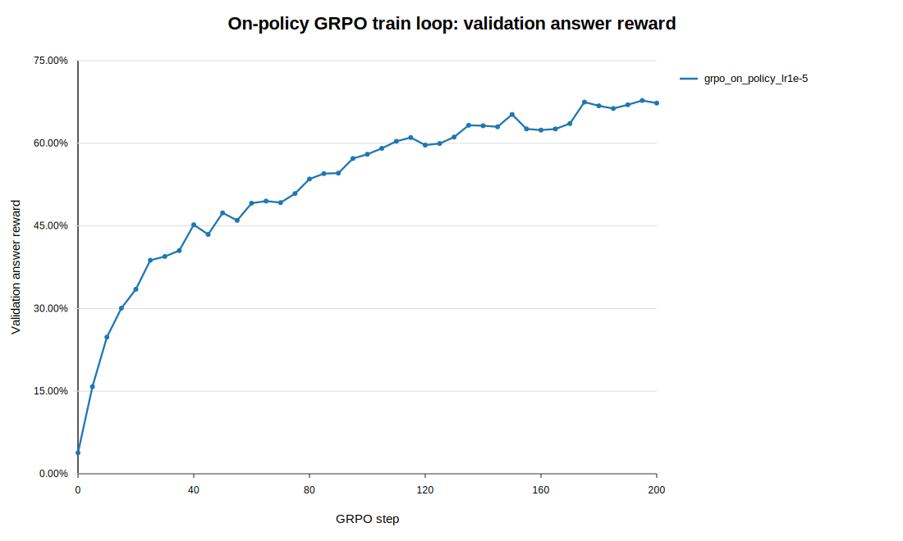

The validation answer reward improved from 3.81% at step 0 to a best value of
67.77% at step 195, ending close to that peak at 67.29% at step 200. Format
accuracy improved from 18.07% to 95.61%, which is important here because the
reward parser depends on the `<think>` and `<answer>` structure. The final
rollout batch had 60.16% answer reward, 98.05% format reward, an average
response length of 207.2 tokens, and token entropy 0.134 on the training
microbatches. These trends confirm that the loop is not merely passing unit
tests: it is producing a large, sustained policy improvement under the
cache-correct inference path.

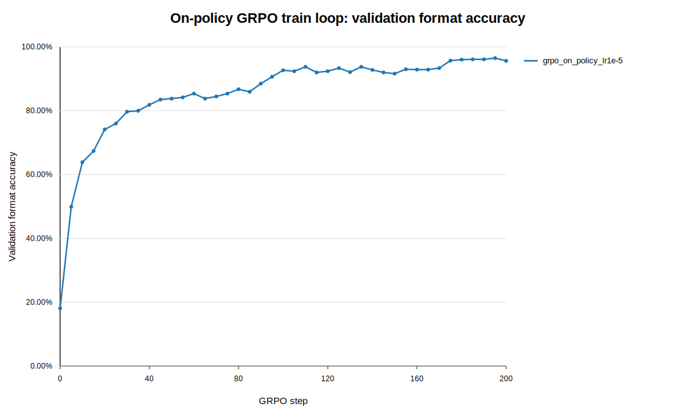

Sample rollouts over time are archived in
`artifacts/experiments/main/ch7/grpo_train_loop/grpo_train_loop_rollout_examples.md`.
The selected examples show the policy moving from mostly malformed or
incorrect responses toward consistently tagged answers with much higher solve
rate. A useful caveat remains: the verifier is answer-based, so a rollout can
receive reward even when the reasoning trace is not fully reliable. That is a
limitation of the reward design rather than a train-loop bug.

The numeric results above are archived in
`artifacts/experiments/main/ch7/grpo_train_loop/run_summaries_archive.md` and
`artifacts/experiments/main/ch7/grpo_train_loop/run_summaries.json`, with the full
eval curve in
`artifacts/experiments/main/ch7/grpo_train_loop/grpo_train_loop_eval_points.csv`.
The raw run data used for this answer are archived under
`artifacts/experiments/main/ch7/grpo_train_loop/runs/grpo_on_policy_lr1e-5/`.

---

## Problem `grpo_learning_rate`: Tune the Learning Rate (2 points, 6 H100 hrs)

**Question:** Starting with the suggested hyperparameters above, perform a sweep over the learning rates and report the final validation answer rewards (or note divergence if the optimizer diverges).

**Deliverable:** Validation reward curves associated with multiple learning rates.

**Deliverable:** A model that achieves validation accuracy of at least 25% on MATH.

**Deliverable:** A brief 2 sentence discussion on any other trends you notice on other logged metrics.

**Answer:** The official course MATH files were not available in this
environment, so we ran this sweep on the same converted
`competition_math_numeric` MATH-like validation set used in the GRPO
experiments. All runs used the R1-Zero prompt, rollout batch size 256, group
size 8, `reinforce_with_baseline`, standard-deviation-normalized advantages,
`masked_mean` loss normalization, and validation every 5 GRPO steps. For
`lr=4e-5`, we use the completed `masked_mean_lr4e-5` run because it has the
same core hyperparameters and the strongest complete 200-step trace. We stopped
clearly suboptimal or collapsed runs early once their validation curves were no
longer competitive.

The run summaries are archived in
`artifacts/experiments/main/ch7/grpo_learning_rate/run_summaries_archive.md` and
`artifacts/experiments/main/ch7/grpo_learning_rate/run_summaries.json`, with the full eval
points in `artifacts/experiments/main/ch7/grpo_learning_rate/grpo_learning_rate_eval_points.csv`.

| learning rate | status | best answer reward | best step | final answer reward | final step | final format accuracy |
|---:|---|---:|---:|---:|---:|---:|
| `3e-6` | stopped early | 10.06% | 50 | 10.06% | 50 | 36.33% |
| `5e-6` | completed | 47.07% | 200 | 47.07% | 200 | 81.93% |
| `1e-5` | completed | 67.77% | 195 | 67.29% | 200 | 95.61% |
| `2e-5` | completed | 85.84% | 200 | 85.84% | 200 | 98.34% |
| `3e-5` | completed | 86.43% | 200 | 86.43% | 200 | 97.75% |
| `4e-5` | completed | **88.18%** | 190 | **88.18%** | 200 | 98.05% |
| `5e-5` | completed | 87.11% | 120 | 84.28% | 200 | 94.63% |
| `7e-5` | stopped early | 21.29% | 50 | 21.29% | 50 | 100.00% |
| `2e-4` | collapsed | 3.81% | 0 | 0.00% | 50 | 0.00% |

The best learning rate was `4e-5`, which reached 88.18% validation answer
reward at both step 190 and the final step 200, comfortably exceeding the 25%
target. We use `4e-5` for the remaining on-policy GRPO experiments.

Other metrics followed the same stability pattern: successful middle learning
rates improved both answer reward and format accuracy, while `2e-4` fully
collapsed to zero reward and zero format accuracy. The `7e-5` run is a useful
warning case: it reached 100% format accuracy by step 50, but only 21.29%
answer reward and very short rollouts, suggesting that too-large updates can
learn a terse formatting behavior without learning the underlying reasoning.

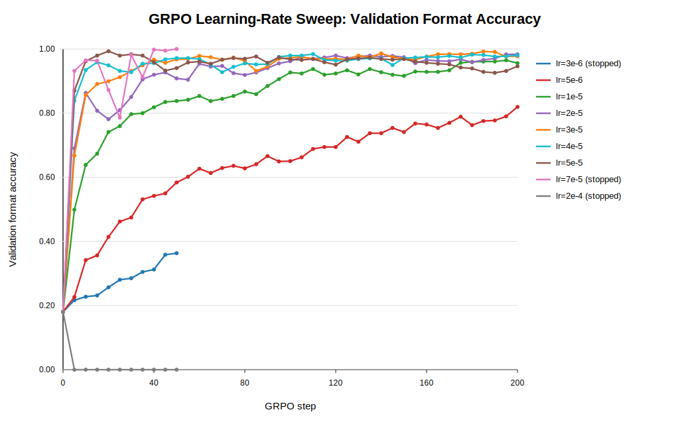

---

## Problem `grpo_baselines`: Effect of Baselining (2 points, 2 H100 hrs)

**Question:** Train a policy with `reinforce_with_baseline` and with `no_baseline`.

**Deliverable:** Validation reward curves associated with each loss type.

**Deliverable:** A brief 2 sentence discussion on any other trends you notice on other logged metrics.

**Answer:** We compared `reinforce_with_baseline` against `no_baseline` using
the tuned `4e-5` learning rate, while keeping the prompt, rollout batch size,
group size, standard-deviation normalization, and loss normalization fixed. Both
runs completed 200 GRPO steps on the converted `competition_math_numeric`
validation set.

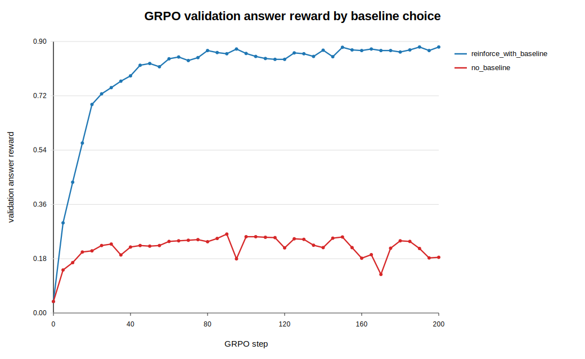

The run summaries are archived in
`artifacts/experiments/main/ch7/grpo_baselines/run_summaries_archive.md` and
`artifacts/experiments/main/ch7/grpo_baselines/run_summaries.json`, with the full eval
points in `artifacts/experiments/main/ch7/grpo_baselines/grpo_baselines_eval_points.csv`,
the train metrics in
`artifacts/experiments/main/ch7/grpo_baselines/grpo_baselines_train_points.csv`, the
rollout metrics in
`artifacts/experiments/main/ch7/grpo_baselines/grpo_baselines_rollout_points.csv`,
and the raw run data under `artifacts/experiments/main/ch7/grpo_baselines/runs/`.

| loss type | best answer reward | best step | final answer reward | final format accuracy | final rollout answer reward | final rollout average length | final token entropy |
|---|---:|---:|---:|---:|---:|---:|---:|
| `reinforce_with_baseline` | **88.18%** | 190 | **88.18%** | **98.05%** | **80.86%** | **466.9** | **0.023** |
| `no_baseline` | 26.17% | 90 | 18.46% | 85.55% | 22.66% | 103.6 | 2.454 |

Baselining made a very large difference. `reinforce_with_baseline` reached
88.18% best validation answer reward and also finished at 88.18%, whereas
`no_baseline` peaked at 26.17% and fell to 18.46% by the final evaluation
despite using the same learning rate and training budget. This supports the
idea that the group-relative baseline is doing more than cosmetic variance
reduction in this sparse-reward setting: it provides a useful within-group
comparison signal, while `no_baseline` mostly reinforces trajectories that
already received reward and offers much weaker corrective pressure on bad ones.

The other logged metrics show that `no_baseline` learns some of the output
format early, but does not learn stable reasoning behavior. It ends with lower
validation format accuracy (85.55%), much lower rollout answer reward (22.66%),
and much higher token entropy (2.454) than the baselined run. In contrast,
`reinforce_with_baseline` ends with 98.05% validation format accuracy, 80.86%
final rollout answer reward, low token entropy (0.023), and much longer final
rollouts averaging 466.9 tokens, which is more consistent with sustained
reasoning than with a brittle answer-template strategy.

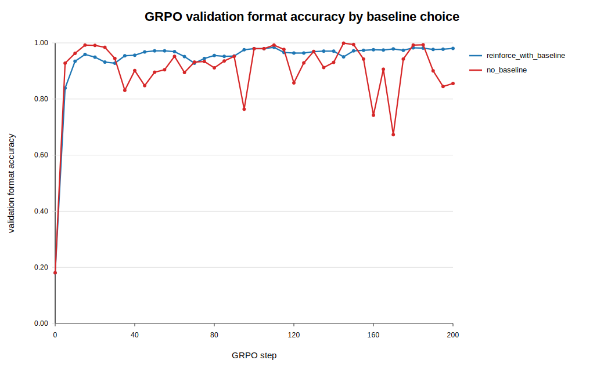

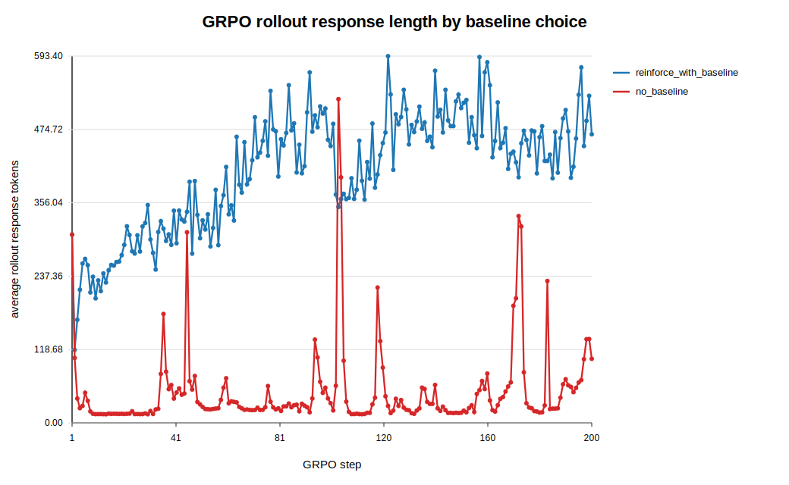

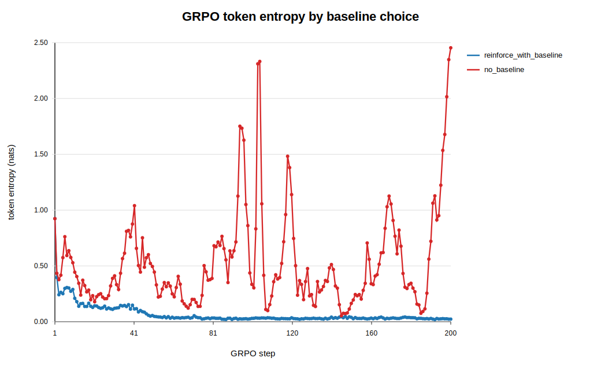

The response-length curve makes this contrast especially clear. Both runs start
from similarly long initial rollouts, but `no_baseline` quickly moves toward
shorter, unstable responses, dropping from about 305 response tokens at step 1
to tens of tokens for much of training and ending at 103.6. The baselined run
instead keeps producing much longer trajectories throughout training, typically
hundreds of tokens late in training and ending at 466.9.

The entropy curve tells a complementary story. `reinforce_with_baseline` starts
near `0.93` token entropy and steadily sharpens to about `0.023` by step 200,
whereas `no_baseline` ends much higher at about `2.454`. As in the EI
experiment, the stronger run is the one that eventually becomes lower-entropy
and more committed; the weaker run remains diffuse and even becomes noisier
late in training. We therefore use
`reinforce_with_baseline` for the remaining GRPO experiments.

---

## Problem `think_about_length_normalization`: Think About Length Normalization (1 point)

**Question:** Compare the two approaches (without running experiments yet). What are the pros and cons of each approach? Are there any specific settings or examples where one approach seems better?

**Deliverable:** Compare the two approaches (without running experiments yet). What are the pros and cons of each approach? Are there any specific settings or examples where one approach seems better?

**Answer:** The two approaches differ in how they assign credit across
responses of different lengths. In our implementation, the batch loss is an
average over per-example aggregated losses. With `masked_mean`, a per-token loss
sequence for completion \(i\) is aggregated as

$$
\mathcal{L} = \frac{1}{B}\sum_{i=1}^{B} L_i,
\qquad
L_i = \frac{1}{T_i}\sum_{t=1}^{T_i} \ell_{it}.
$$

where \(T_i\) is the number of response tokens. This makes each completion have
roughly comparable total weight in the batch, regardless of whether it is short
or long. The main benefit is stability: a long, noisy, or malformed response
does not dominate the gradient just because it contains many tokens. The
downside is that each token in a long reasoning trace receives less credit or
blame than each token in a short response, so `masked_mean` can dilute the
learning signal for long chains of reasoning.

With `masked_normalize`, the same batch structure is kept, but the per-example
aggregation uses a fixed constant \(C\), such as the maximum generation length:

$$
L_i = \frac{1}{C}\sum_{t=1}^{T_i} \ell_{it}.
$$

This is closer to the policy-gradient objective based on the log-probability of
a trajectory, since the trajectory log-probability itself is a sum over token
log-probabilities. Its main advantage is that it does not shrink the total loss
of a long response just because that response contains more tokens. This can be
preferable when correct solutions genuinely require multi-step reasoning, since
the contribution from a long solution is not averaged down by its own length.
The tradeoff is higher length-dependent variance: longer responses receive
larger total weight, so long incorrect, rambling, or format-breaking
completions can have a larger effect on the update.

The `batch_token_mean` variant makes a third choice: instead of first forming a
per-example loss, it averages the masked token losses over all response tokens
in the optimizer batch:

$$
\mathcal{L}
= \frac{\sum_{i=1}^{B}\sum_{t=1}^{T_i}\ell_{it}}
        {\sum_{i=1}^{B} T_i}.
$$

This gives every token equal weight, so a completion with twice as many response
tokens contributes about twice as much total gradient as a shorter completion.
In that sense it shares the length-dependent credit assignment of
`masked_normalize`. However, unlike `masked_normalize` with a fixed constant
\(C\), the denominator adapts to the actual number of generated tokens in the
batch. That keeps the overall loss scale more stable across batches with very
different average response lengths. The cost is that the objective becomes more
explicitly token-weighted: long completions dominate the batch average, while
short completions have less influence. If all completions have the same length,
`batch_token_mean` and `masked_mean` are equivalent up to the same batch
average; when lengths vary, `batch_token_mean` is closer to weighting tokens
equally than weighting examples equally.

Thus, `masked_mean` is a safer choice when response lengths vary widely or when
the model tends to generate long low-quality outputs, because it treats each
completion more like one training example. `masked_normalize` and
`batch_token_mean` are more appealing when the task rewards long, useful
reasoning traces and we want the optimization to stay closer to a trajectory-sum
view of the policy-gradient objective. In short, this choice is not just a
harmless rescaling of the loss: `masked_mean` is closer to weighting each
completion equally, `masked_normalize` gives longer responses proportionally
more total influence under a fixed denominator, and `batch_token_mean` gives
longer responses proportionally more influence while stabilizing the batch-level
scale by dividing by the actual number of response tokens.

---

## Problem `grpo_length_normalization`: Effect of Length Normalization (2 points, 2 H100 hrs)

**Question:** Compare normalization with `masked_mean` and `masked_normalize` with an end-to-end GRPO training run. Report the validation answer reward curves. Comment on the findings, including any other metrics that have a noticeable trend.

**Deliverable:** Compare normalization with `masked_mean` and `masked_normalize` with an end-to-end GRPO training run. Report the validation answer reward curves. Comment on the findings, including any other metrics that have a noticeable trend.

**Answer:** We compared the selected `masked_mean` reference run against a
`masked_normalize` run with the same on-policy setup, learning rate `4e-5`,
group size 8, standard-deviation-normalized advantages, and
`loss_normalize_constant=1024`. The plot also includes `batch_token_mean` as an
additional reference. `masked_mean` was the best length-normalization choice,
but the gap was small: `masked_mean` reached a best validation answer reward of
88.18% at steps 190 and 200, while
`masked_normalize` reached 87.11% at steps 165 and 200. The
`batch_token_mean` reference reached 86.91% at step 110 and ended at 86.43%.

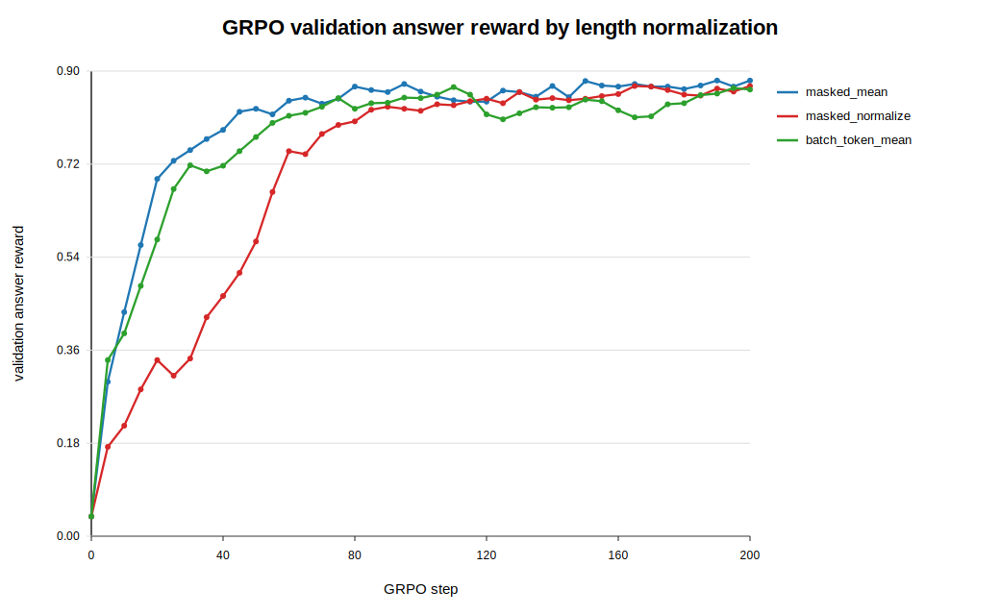

The main difference was learning speed rather than a late-training collapse. At
step 25, `masked_mean` had already reached 72.66% validation answer reward,
compared with 31.05% for `masked_normalize`; at step 50, the corresponding
values were 82.71% and 57.03%. `masked_normalize` then caught up steadily,
reaching 79.59% by step 75 and 87.11% by the end. The validation format
accuracy also stayed high for all three runs at the end: 98.05% for
`masked_mean`, 96.48% for `masked_normalize`, and 98.83% for
`batch_token_mean`.

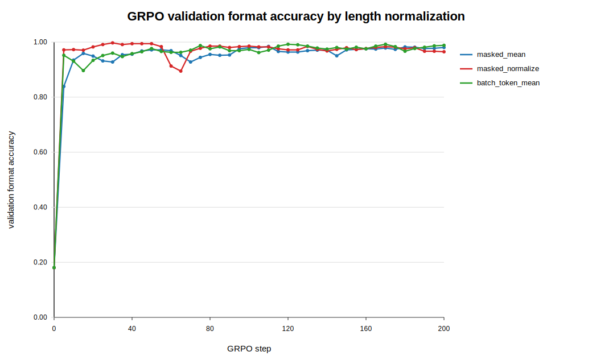

The rollout response lengths help explain the slower start for
`masked_normalize`. Its average rollout length briefly fell to only 34.9 tokens
at step 5, so with a fixed denominator of 1024 those short completions received
small total update weight. Later, the same run grew to the longest final
responses, ending at 512.1 tokens. By comparison, `masked_mean` ended at 466.9
tokens and `batch_token_mean` ended at 375.3 tokens.

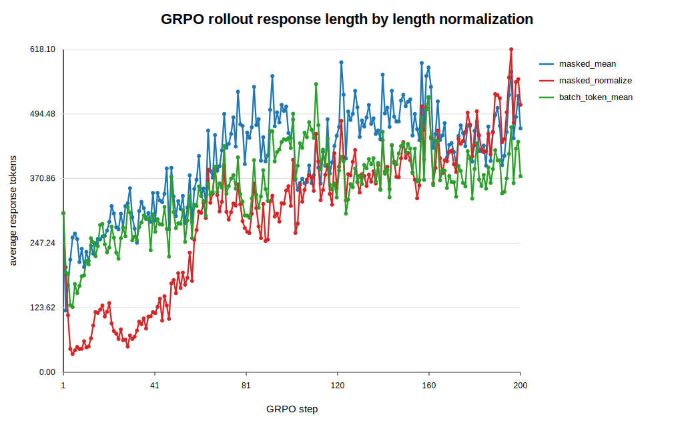

The gradient-norm curve is consistent with this interpretation. Our logged
gradient norm is the pre-clipping norm returned by `clip_grad_norm_`; the final
value was 0.1357 for `masked_mean`, 0.0649 for `masked_normalize`, and 0.1934
for `batch_token_mean`. `masked_normalize` therefore had the smallest final
raw gradient scale in this run, which matches the fixed-denominator intuition:
while responses are shorter than the maximum generation length, summing token
losses and dividing by 1024 downweights each completion relative to
`masked_mean`.

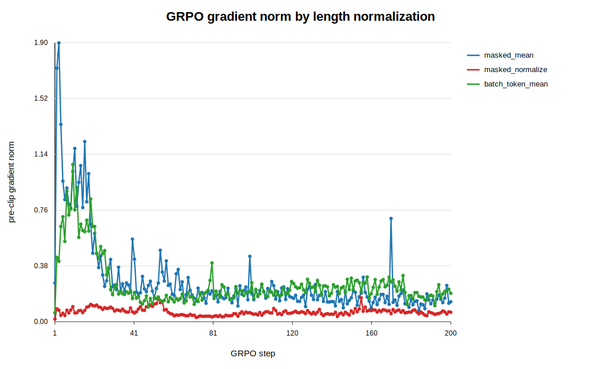

The token-entropy curve provides a useful companion diagnostic. All three runs
rapidly moved from the high-entropy initial policy into a low-entropy regime by
the end of training. The final mean token entropy was 0.0233 for `masked_mean`,
0.0282 for `masked_normalize`, and 0.0196 for `batch_token_mean`. Thus,
`masked_normalize` retained slightly higher entropy at the end, but the entropy
differences were small compared with the differences in validation reward,
response length, and gradient scale. We interpret entropy here as supporting
evidence that none of the runs suffered an obvious late-training randomness
collapse; the main effect of the normalization choice was still the speed and
scale of credit assignment.

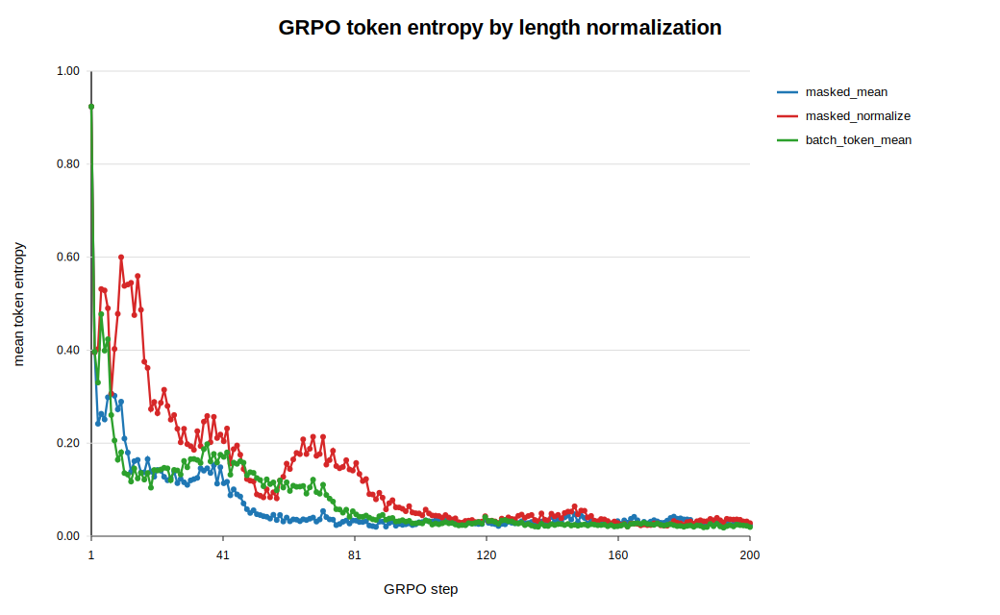

Based on this experiment, we fixed `masked_mean` as the better-performing
length-normalization choice for the following on-policy ablations. The reason is
not that `masked_normalize` failed outright, but that `masked_mean` learned much
faster and still finished with the highest validation answer reward. Mechanically,
`masked_mean` treats each completion more like one training example regardless
of length, while `masked_normalize` makes a completion's total influence roughly
proportional to its response length divided by the fixed normalization constant.
That length-dependent weighting can be useful in some settings, but here it
made early learning slower without improving the final score.

---

## Problem `grpo_group_standard_deviation`: Effect of Standard Deviation Normalization (2 points, 2 H100 hrs)

**Question:** Compare the performance of `use_std_normalization == True` and `use_std_normalization == False`. Report the validation answer reward curves. Comment on the findings, including any other metrics that have a noticeable trend.

**Deliverable:** Compare the performance of `use_std_normalization == True` and `use_std_normalization == False`. Report the validation answer reward curves. Comment on the findings, including any other metrics that have a noticeable trend.

**Answer:** We compared the selected `masked_mean` on-policy configuration with
and without group standard-deviation normalization, keeping the learning rate at
`4e-5` and all other settings fixed. Both variants trained successfully and
ended with very similar validation answer reward. The
`use_std_normalization=True` run was slightly stronger, reaching its best
validation answer reward of 88.18% at step 190 and again ending at 88.18% at
step 200. The `use_std_normalization=False` run reached its best and final
validation answer reward of 87.21% at step 200.

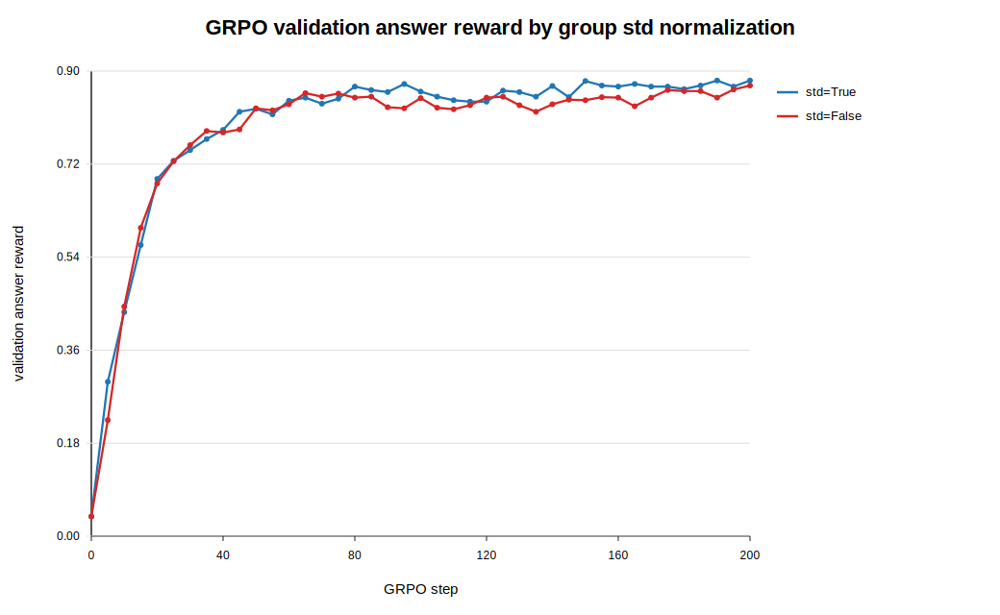

The validation format accuracy was also close. The `std=True` run ended at
98.05% validation format accuracy, compared with 97.66% for `std=False`. This
suggests that the small answer-reward gap was not driven by a major formatting
failure in either run; both policies learned to produce the requested answer
format reliably.

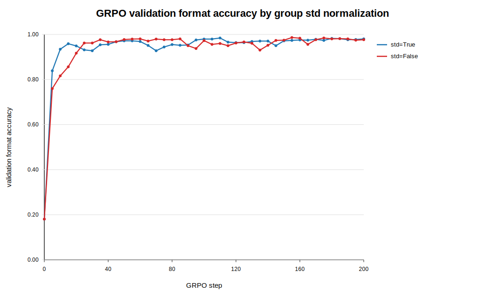

The rollout metrics show the same small advantage for standard-deviation
normalization. At the final step, `std=True` had 80.86% rollout answer reward
and 94.14% rollout format reward, with an average response length of 466.9
tokens. The `std=False` run ended at 79.30% rollout answer reward and the same
94.14% rollout format reward, with a slightly shorter average response length
of 453.1 tokens.

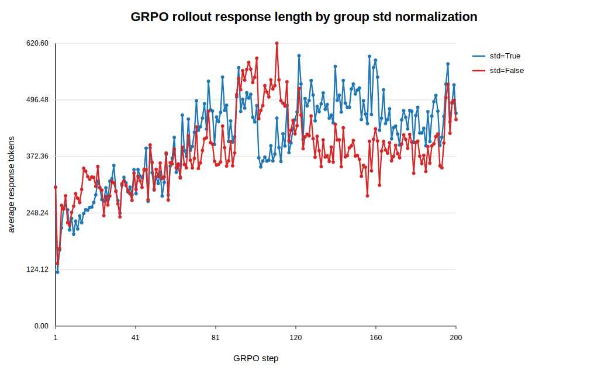

Token entropy decreased in both runs as the model became more deterministic.
The final entropy was low for both variants, with `std=True` ending at 0.023
and `std=False` ending at 0.031. The `std=False` run therefore retained
slightly more token-level uncertainty at the end, but this did not translate
into higher validation reward.

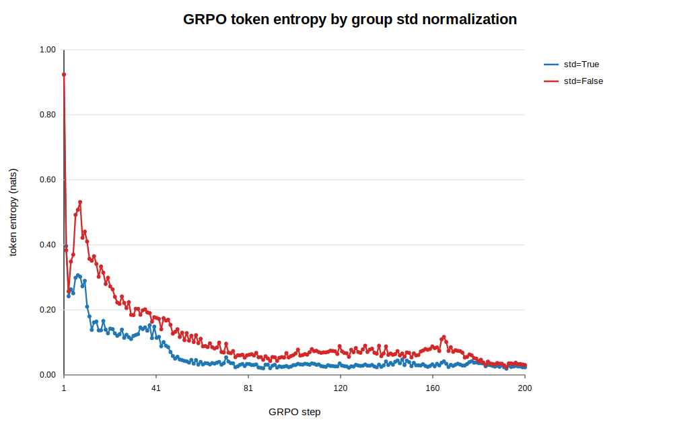

The gradient norm trend is benign in this run. The logged gradient norm is the
pre-clipping norm returned by `clip_grad_norm_`; both variants ended with small
pre-clip norms, 0.136 for `std=True` and 0.054 for `std=False`. Since the
actual update is clipped to max norm 1.0, these final values indicate that the
late-stage updates were already below the clipping threshold.

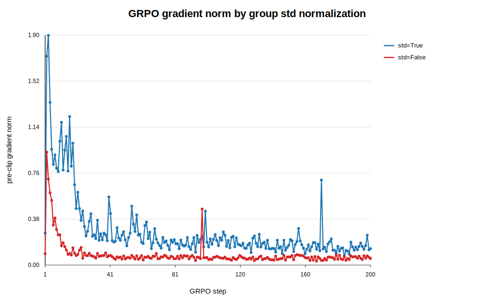

Overall, this experiment suggests that group standard-deviation normalization is
not harmful for the selected `masked_mean`, `lr=4e-5` setting and may give a
small improvement. Its effect is modest, however: both variants converge to
roughly the same validation answer reward and formatting accuracy.

---

## Problem `grpo_off_policy`: Implement Off-Policy GRPO

**Question:** Depending on your implementation of the full GRPO train loop above, you may already have the infrastructure to do this. If not, you need to implement the following: you should be able to take multiple epochs of gradient steps per rollout batch, where the number of epochs and optimizer updates per rollout batch are controlled by `rollout_batch_size`, `epochs_per_rollout_batch`, and `train_batch_size`; edit your main training loop to get response logprobs from the policy after each rollout batch generation phase and before the inner loop of gradient steps, which will be the `old_log_probs`; and use the `"GRPO-Clip"` loss type.

**Deliverable:** Implement off-policy GRPO training.

**Answer:** We extended the GRPO training script to support true off-policy
updates by (1) allowing multiple epochs of gradient steps over the same rollout
batch, (2) computing and caching `old_log_probs` immediately after each rollout
generation phase and before the inner optimization loop, and (3) enabling the
`grpo_clip` loss for these reused rollouts. In our implementation, the total
number of optimizer updates per rollout batch is controlled by
`epochs_per_rollout_batch * rollout_batch_size / train_batch_size`, so the
off-policy sweep below directly changes the reuse strength through these two
hyperparameters.

---

## Problem `grpo_off_policy_sweep`: Off-Policy GRPO Hyperparameter Sweep (4 points, 12 H100 hrs)

**Question:** Fixing `rollout_batch_size = 256`, choose a range over `epochs_per_rollout_batch` and `train_batch_size` to sweep over. First do a broad sweep for a limited number of GRPO steps (`< 50`) to get a sense of the performance landscape, and then a more focused sweep for a larger number of GRPO steps (200). Provide a brief experiment log explaining the ranges you chose. Compare to your on-policy run with `epochs_per_rollout_batch = 1` and `train_batch_size = 256`, reporting plots with respect to number of validation steps as well as with respect to wall-clock time. Report the validation answer reward curves. Comment on the findings, including any other metrics that have a noticeable trend such as entropy and response length. Compare the entropy of the model's responses over training to what you observed in the EI experiment.

**Deliverable:** Fixing `rollout_batch_size = 256`, choose a range over `epochs_per_rollout_batch` and `train_batch_size` to sweep over. First do a broad sweep for a limited number of GRPO steps (`< 50`) to get a sense of the performance landscape, and then a more focused sweep for a larger number of GRPO steps (200). Provide a brief experiment log explaining the ranges you chose.

**Deliverable:** Compare to your on-policy run with `epochs_per_rollout_batch = 1` and `train_batch_size = 256`, reporting plots with respect to number of validation steps as well as with respect to wall-clock time.

**Deliverable:** Report the validation answer reward curves. Comment on the findings, including any other metrics that have a noticeable trend such as entropy and response length. Compare the entropy of the model's responses over training to what you observed in the EI experiment.

**Answer:** Because the official course MATH files were not available in our
self-hosted environment, we ran this sweep on the same
`competition_math_numeric` MATH-like substitute dataset used in the on-policy
GRPO experiments. All runs used a single GPU with `policy_device = cuda:0` and
`vllm_device = cuda:0`. We fixed `rollout_batch_size = 256`, `group_size = 8`,
`learning_rate = 4e-5`, `loss_type = grpo_clip`,
`loss_normalization = masked_mean`, and `use_std_normalization = true`, then
varied `epochs_per_rollout_batch` and `train_batch_size`. The number of
optimizer updates per rollout batch is
`epochs_per_rollout_batch * rollout_batch_size / train_batch_size`, so the
sweep tests both mild reuse and aggressive repeated updates on the same
rollout data.

The broad validation answer-reward curves are shown below.

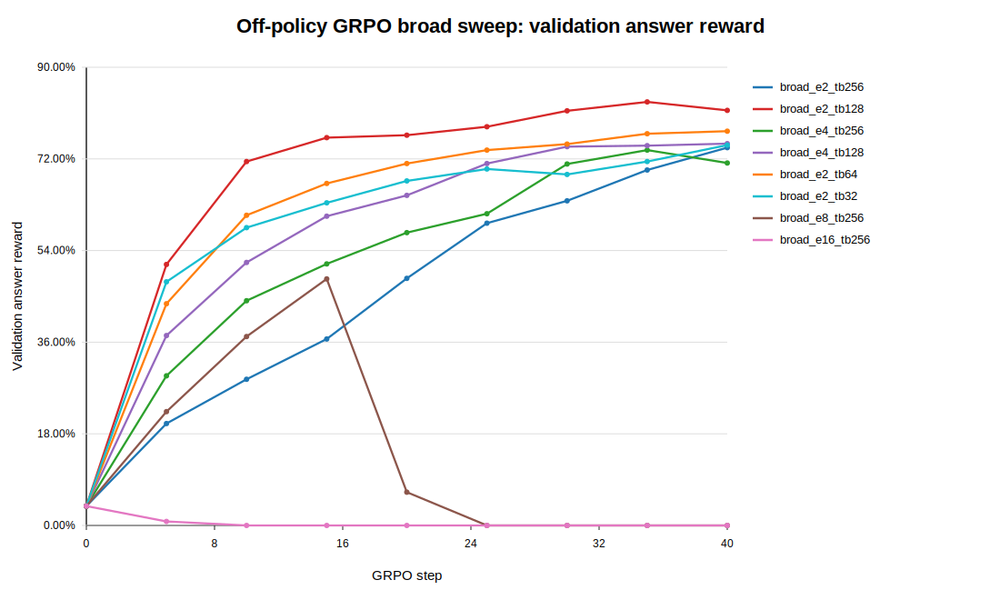

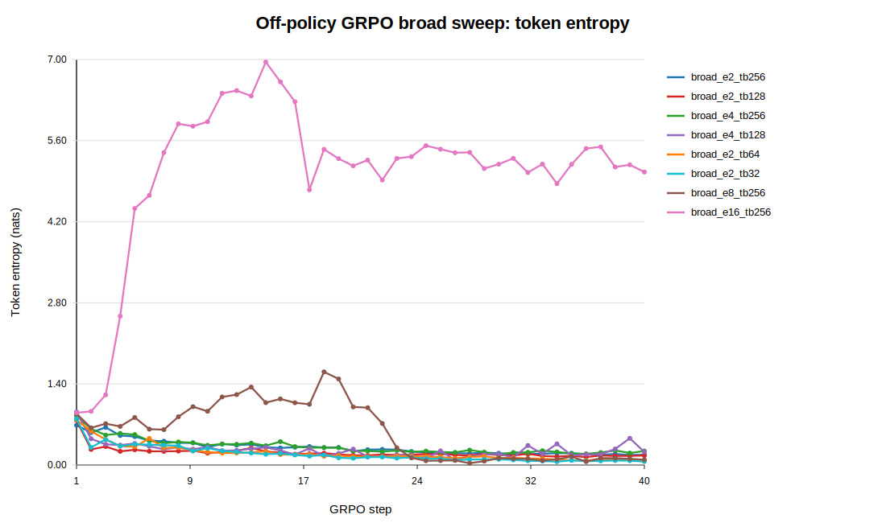

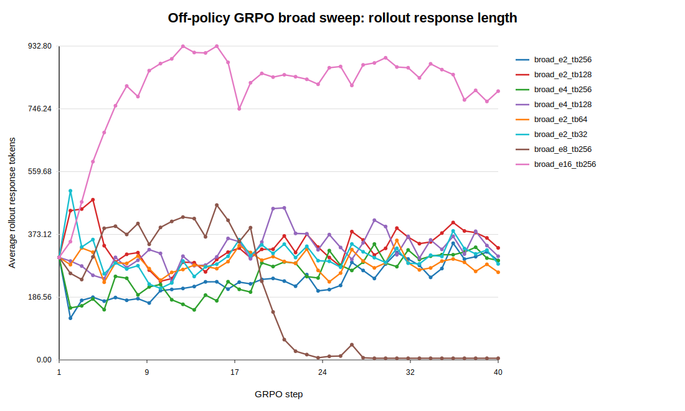

The broad-sweep summaries and archived logs are stored under
`artifacts/experiments/main/ch7/grpo_off_policy_sweep/`, especially
`grpo_off_policy_experiment_log.md`,
`grpo_off_policy_broad_summary.csv`, `run_summaries.json`, and
`runs/`. The broad-sweep results are:

| run | role | optimizer updates / rollout batch | best answer acc | best step | final answer acc | final format acc |
|---|---|---:|---:|---:|---:|---:|
| `broad_e2_tb256` | true off-policy | 2 | 74.22% | 40 | 74.22% | 94.43% |
| `broad_e2_tb128` | true off-policy | 4 | **83.20%** | 35 | **81.54%** | 95.61% |
| `broad_e4_tb256` | true off-policy | 4 | 73.73% | 35 | 71.19% | 94.92% |
| `broad_e4_tb128` | true off-policy | 8 | 75.00% | 40 | 75.00% | 87.79% |
| `broad_e2_tb64` | true off-policy | 8 | 77.44% | 40 | 77.44% | 96.39% |
| `broad_e2_tb32` | true off-policy | 16 | 74.71% | 40 | 74.71% | 97.07% |
| `broad_e8_tb256` | true off-policy | 8 | 48.44% | 15 | 0.00% | 0.00% |
| `broad_e16_tb256` | true off-policy | 16 | 3.81% | 0 | 0.00% | 0.00% |

The broad sweep shows that moderate off-policy reuse is viable, but repeated
full-batch reuse is unstable. The best broad run was `broad_e2_tb128`, which
uses two epochs and `train_batch_size = 128`, i.e. four optimizer updates per
rollout batch. It reached 83.20% validation answer accuracy by step 35 and
finished at 81.54%. Smaller train batches under `epochs_per_rollout_batch = 2`
also worked: `e2_tb64` and `e2_tb32` finished at 77.44% and 74.71%,
respectively. This is an important diagnostic because `e2_tb32` and
`e16_tb256` both perform 16 optimizer updates per rollout batch, but only
`e16_tb256` collapses. The failure mode is therefore not just the raw number of
updates; it is especially harmful to repeat many epochs over the same full
rollout batch.

The entropy and response-length curves make the broad-sweep failures visible.
The successful settings reduce token entropy into a low but finite regime and
keep rollout lengths in the few-hundred-token range. By contrast, the
aggressive full-batch settings lose validation reward: `e8_tb256` rises early,
peaking at 48.44% on step 15, and then drops to 0%, while `e16_tb256` is
effectively collapsed after the initial evaluation. These failures coincide
with degenerate formatting/reward behavior rather than a smooth plateau.

For the focused 200-step comparison, we extended the strongest and most
informative off-policy settings: `e2_tb256`, `e2_tb128`, and `e4_tb256`. We
compare them to the matched on-policy reference from the selected on-policy
GRPO configuration, `masked_mean_lr4e-5`, which uses
`epochs_per_rollout_batch = 1`, `train_batch_size = 256`,
`use_std_normalization = true`, and the same dataset, prompt, rollout batch
size, group size, and learning rate.

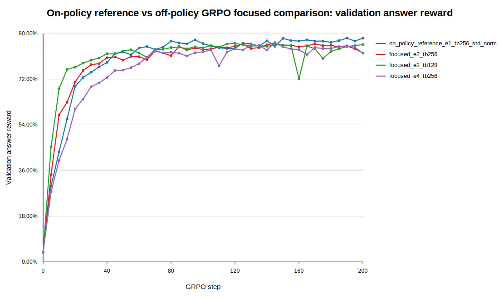

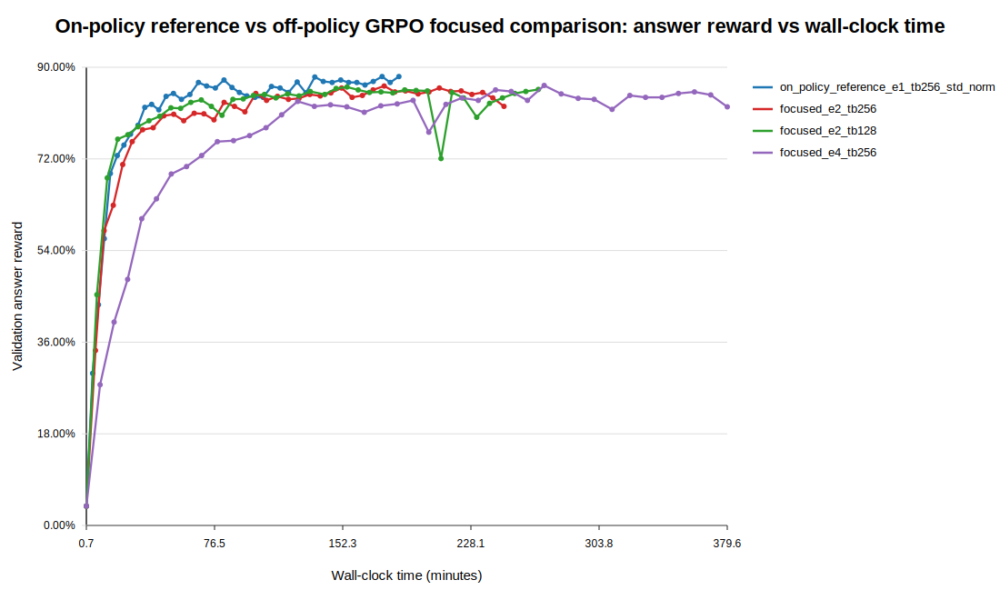

The focused comparison is:

| run | role | optimizer updates / rollout batch | best answer acc | best step | final answer acc | final format acc | final avg length | final token entropy |
|---|---|---:|---:|---:|---:|---:|---:|---:|
| `on_policy_reference_e1_tb256_std_norm` | on-policy reference | 1 | **88.18%** | 190 | **88.18%** | 98.05% | 466.9 | 0.023 |
| `focused_e2_tb256` | true off-policy | 2 | 86.33% | 145 | 82.32% | 98.14% | 474.8 | 0.033 |
| `focused_e2_tb128` | true off-policy | 4 | 86.13% | 120 | 85.64% | 96.68% | 547.4 | 0.028 |
| `focused_e4_tb256` | true off-policy | 4 | 86.43% | 145 | 82.23% | 97.07% | 437.9 | 0.027 |

The focused runs confirm the broad-sweep picture. True off-policy GRPO can
learn strongly when the reuse is not too aggressive: all three focused runs
reach at least 86.13% validation answer accuracy, and none collapses over 200
steps. However, the matched on-policy reference remains the best overall run,
peaking and finishing at 88.18%. Among the off-policy settings, `e4_tb256` has
the highest peak, 86.43% at step 145, but `e2_tb128` is the best final
off-policy run, ending at 85.64%. We would therefore select `e2_tb128` if the
objective is a stable off-policy configuration, while keeping the on-policy
`e1_tb256` run as the stronger final baseline.

The wall-clock plot does not overturn this conclusion. Extra reuse can improve
the amount of learning per rollout batch, but it also adds optimizer work after
each generation phase. In this single-GPU setting, the focused off-policy runs
do not produce a better reward-vs-time frontier than the matched on-policy
reference.

The entropy and response-length diagnostics are shown below.

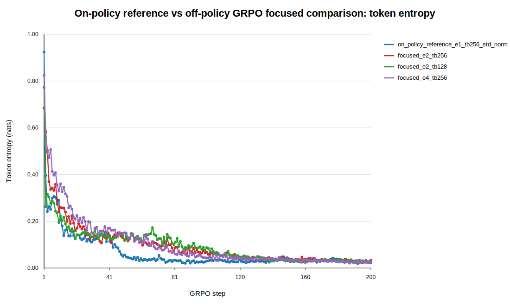

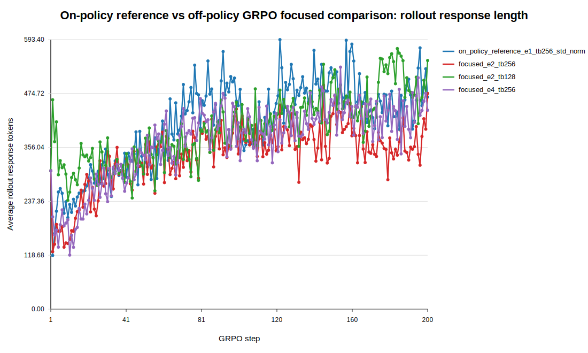

The entropy behavior is qualitatively similar to what we observed in expert
iteration: as the policy improves, token entropy falls because the model
becomes more confident about its response distribution. The GRPO runs end in an
even lower-entropy regime than the EI sweep. The final focused off-policy
entropies are all around `0.03` nats, close to the on-policy reference's
`0.023` nats. This low entropy is not by itself a failure signal, since the
high-reward runs also have low entropy. The problematic signal is low or
pathological entropy paired with reward collapse, malformed outputs, or
degenerate response lengths, as in the aggressive broad settings.

Response length is the other useful diagnostic. The stable focused runs finish
with average rollout lengths between about 438 and 547 tokens, comparable to
the on-policy reference's 467 tokens. The longest final focused run,
`e2_tb128`, is also the best final off-policy run, so longer responses are not
automatically bad here. The broad collapses are different: they are associated
with severe reward and format failures, showing that the model has left the
useful reasoning-and-formatting regime.

Overall, the sweep suggests that off-policy reuse can be made stable with
standard-deviation-normalized advantages and `masked_mean` loss normalization,
but it did not beat the matched on-policy run. Moderate reuse is best; too many
epochs over the same full rollout batch makes the policy update stale and
unstable.

---

## Problem `grpo_off_policy_clip_ablation`: Off-Policy GRPO-Clip Ablation (2 points, 2 H100 hrs)

**Question:** Implement the unclipped per-token loss as a new loss type `"GRPO-No-Clip"`. Take your best performing off-policy hyperparameters from the previous problem and run the unclipped version of the loss. Report the validation answer reward curves. Comment on the findings compared to your GRPO-Clip run, including any other metrics that have a noticeable trend such as entropy, response length, and gradient norm.

**Deliverable:** Implement the unclipped per-token loss as a new loss type `"GRPO-No-Clip"`. Take your best performing off-policy hyperparameters from the previous problem and run the unclipped version of the loss. Report the validation answer reward curves. Comment on the findings compared to your GRPO-Clip run, including any other metrics that have a noticeable trend such as entropy, response length, and gradient norm.

**Answer:** We implemented the unclipped off-policy surrogate as a new loss type
`GRPO-No-Clip` and compared it against the selected true off-policy
configuration from the sweep above: `epochs_per_rollout_batch=2`,
`train_batch_size=256`, `rollout_batch_size=256`, `learning_rate=4e-5`,
`loss_normalization=masked_mean`, and `use_std_normalization=True`. In addition
to the standard symmetric clipped objective with `cliprange_low=0.2` and
`cliprange_high=0.2`, we also ran an asymmetric clipped variant with
`cliprange_low=0.2` and `cliprange_high=0.28`.

In this setting, clipping is important for stability. The symmetric clipped
run is the best of the three: it reaches a best validation answer reward of
86.33% at step 145 and finishes at 82.32%. The asymmetric clipped run is also
strong but slightly worse, peaking at 83.79% at step 150 and finishing at
78.91%. By contrast, `GRPO-No-Clip` only reaches 24.61% at step 125 and then
collapses completely, finishing at 0.00% answer reward and 0.00% format
accuracy.

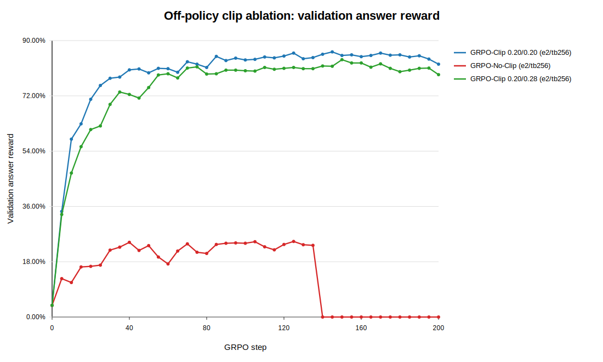

The wall-clock comparison tells the same story. Both clipped objectives learn
rapidly and remain useful through the end of training, while the unclipped run
never becomes competitive and loses all validation reward late in training.

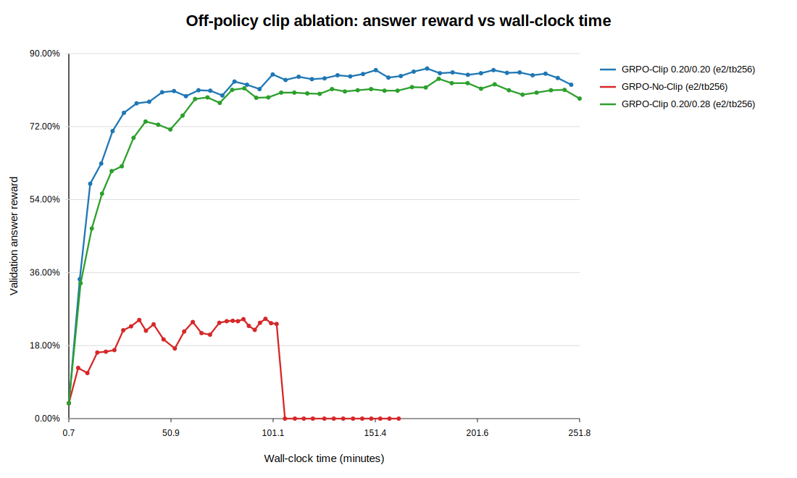

The response-length diagnostics show different failure modes. The symmetric
clipped run finishes with an average rollout response length of 474.8 tokens
and 98.14% validation format accuracy, which is close to the healthy
off-policy/on-policy regime from the GRPO experiments above. The asymmetric
clipped run is longer at 587.0 tokens and finishes slightly lower at 94.73%
format accuracy, suggesting that the looser upper clip bound allows larger
policy-ratio increases but does not improve final reward. The unclipped run
collapses to short, unproductive outputs: it finishes at 155.8 tokens on
average with 0.00% format accuracy.

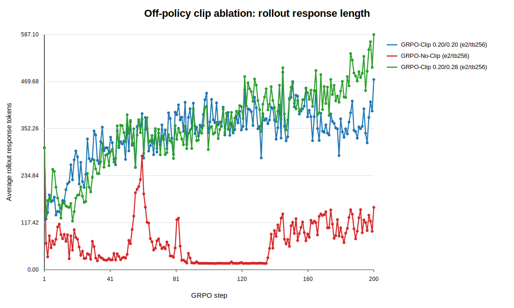

The entropy and gradient-norm curves reinforce this interpretation. The
symmetric clipped run ends with low entropy (`0.033`) and a small but nonzero
gradient norm (`0.091`), which matches a confident policy that is still
training normally. The asymmetric clipped run keeps much higher final entropy
(`0.597`) and gradient norm (`0.285`), consistent with its larger response
length and looser upper-ratio constraint. The no-clip run's last finite
gradient norm is exactly `0.000`, and its validation reward has already
collapsed, so the objective is no longer producing useful updates.

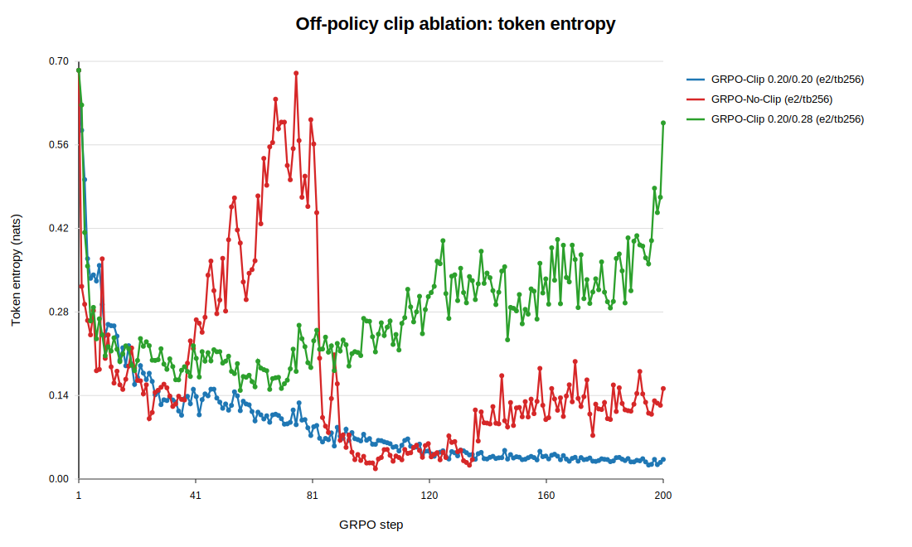

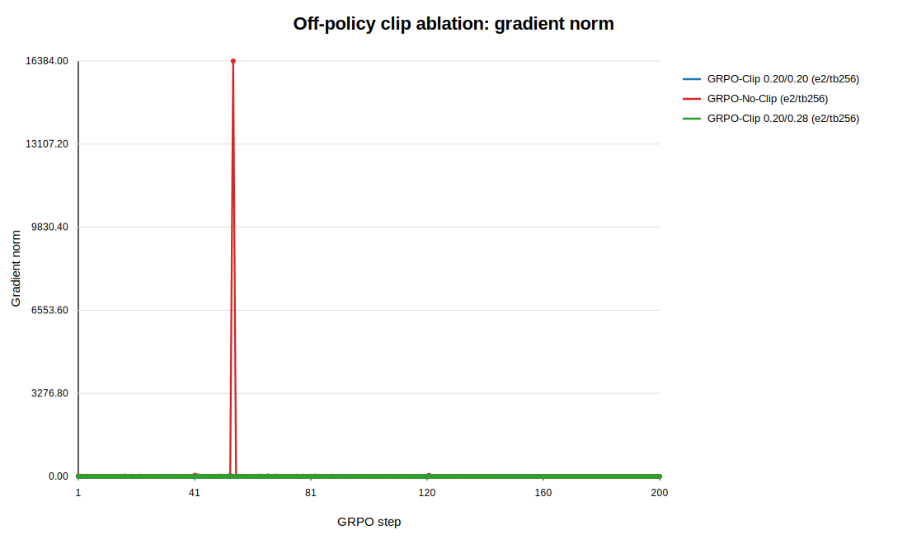

Overall, this ablation supports the standard intuition behind GRPO-Clip in the
off-policy setting. Reusing each rollout batch for two epochs makes the
importance-ratio correction matter: without clipping, stale samples can create
updates that move the policy away from the sampled behavior too aggressively,
and the run collapses. Symmetric clipping is the most reliable choice here.
Relaxing only the upper bound to `0.28` still works, but it gives up a few
points of final reward and produces longer, higher-entropy responses, so the
extra freedom does not appear beneficial for this `e2/tb256` configuration.

---

## Problem `grpo_prompt_ablation`: Prompt Ablation (2 points, 2 H100 hrs)

**Question:** Report the validation answer reward curves for both the R1-Zero prompt and the question-only prompt. How do metrics compare, including any other metrics that have a noticeable trend such as entropy, response length, and gradient norm? Try to explain your findings.

**Deliverable:** Report the validation answer reward curves for both the R1-Zero prompt and the question-only prompt. How do metrics compare, including any other metrics that have a noticeable trend such as entropy, response length, and gradient norm? Try to explain your findings.

**Answer:** We compare the R1-Zero reference run with the question-only run.
The reference uses `r1_zero.prompt` with `r1_zero_reward_fn` and `</answer>`
stopping. The question-only run uses `question_only.prompt` with
`question_only_reward_fn` and no `</answer>` stop string. Both runs use
`learning_rate=4e-5`, `rollout_batch_size=256`, `train_batch_size=256`,
`epochs_per_rollout_batch=1`, `group_size=8`,
`use_std_normalization=True`, and 200 GRPO steps. The reference uses
`reinforce_with_baseline`, while the question-only run uses `grpo_clip`, so
this should still be interpreted as a prompt-and-evaluation contract
comparison rather than a pure prompt-wording ablation.

The comparison is nuanced: question-only gives a much stronger starting point,
while the R1-Zero reference reaches the stronger final model. The question-only
run starts at 56.74% validation answer reward before any RL updates, reaches
80.08% by step 50, and then improves more gradually to its best and final value
of 85.16% at step 200. The R1-Zero reference starts much lower, at 3.81%, but
improves more throughout training and reaches 88.18% at both its best
checkpoint, step 190, and the final checkpoint, step 200.

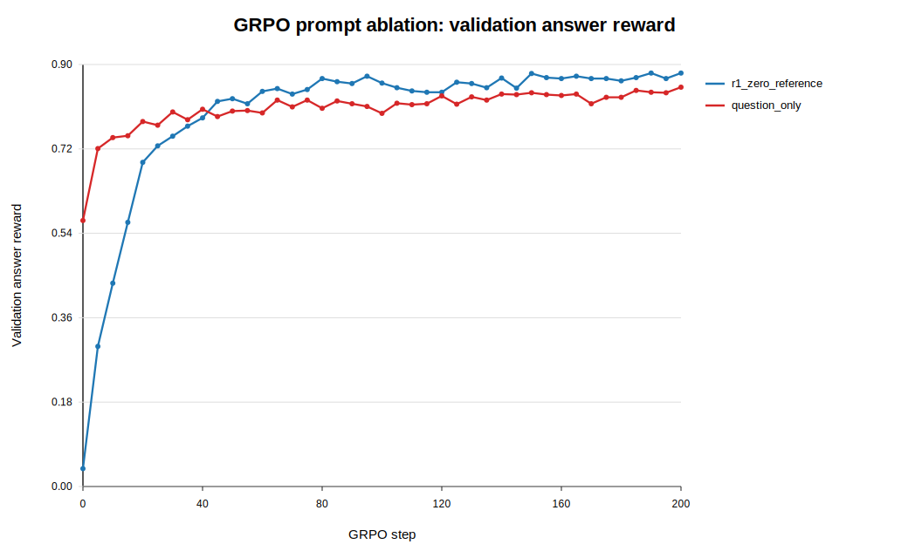

The format-accuracy curve shows that both runs learn their required output
contract. The R1-Zero reference finishes slightly higher on validation
format accuracy, 98.05% versus 97.66%, despite having the stricter output
protocol. The question-only prompt therefore mainly changes the optimization
path rather than simply fixing parser failures: it gives a far stronger initial
policy under a natural boxed-answer contract, but the stricter R1-Zero contract
catches up once RL has learned the tag format.

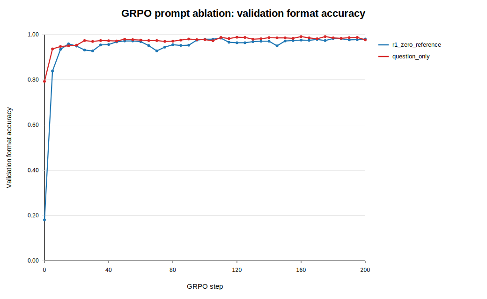

The rollout diagnostics support that interpretation. The question-only run
ends with a slightly shorter average rollout response than the R1-Zero
reference, 460.5 versus 466.9 tokens, and a slightly lower final rollout answer
reward, 79.30% versus 80.86%. Its late token entropy is higher (`0.130` versus
`0.023`), but still stable rather than noisy, and its final gradient norm is
lower (`0.093` versus `0.136` for the R1-Zero reference).

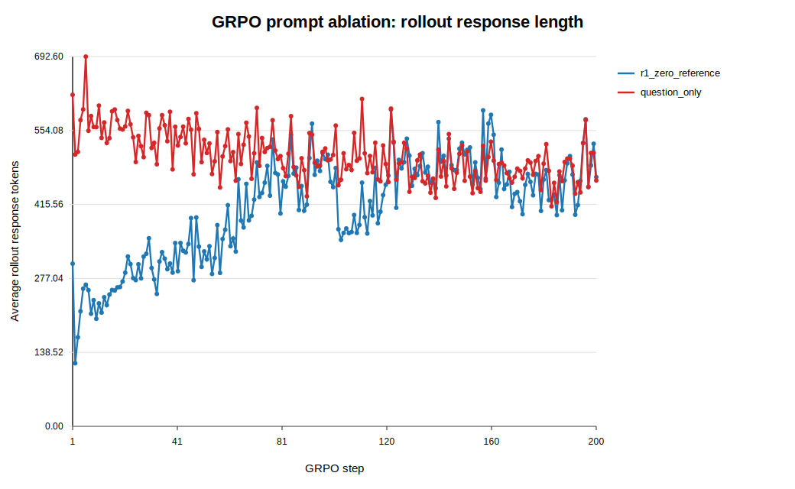

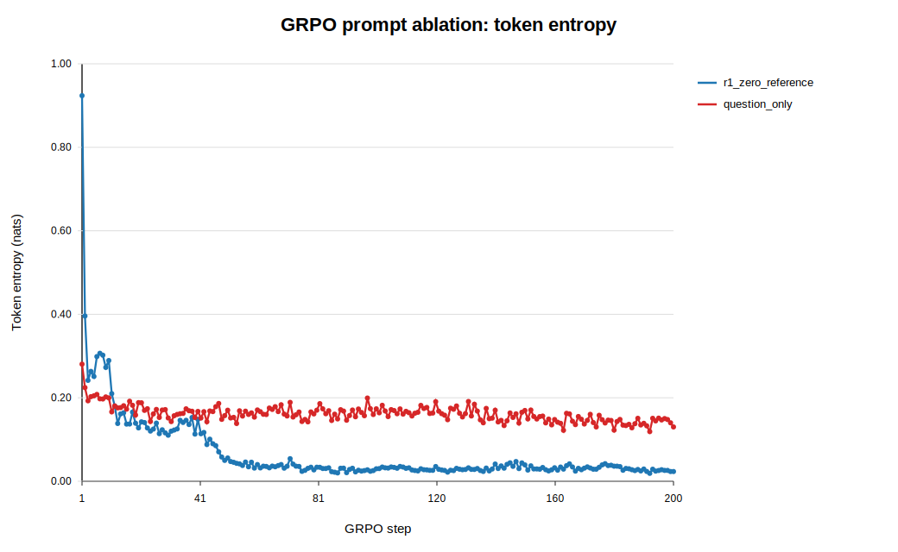

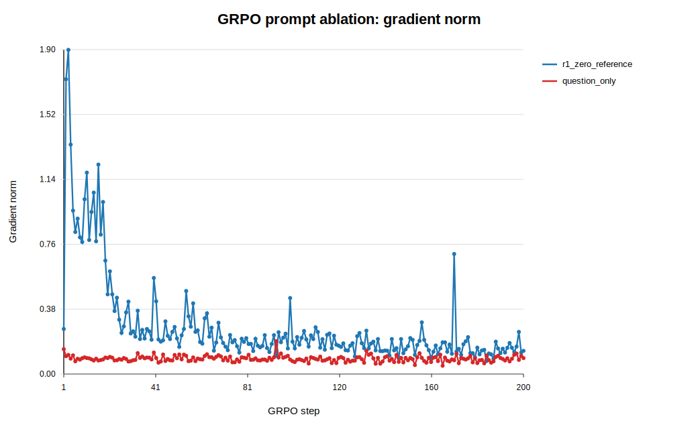

The most plausible explanation is that Qwen2.5-Math-1.5B is already well
aligned with the simpler question-only prompt, so RL begins from a much better
initial policy and then refines it steadily instead of spending capacity on a
brittle answer-tag protocol early on. However, this should not be interpreted
as a pure surface-form prompt comparison, because the reward function, stop
contract, and loss type also change with the prompt. The result is best
understood as showing that question-only is easier at initialization and
remains competitive, but the R1-Zero reference becomes stronger after
enough RL updates.

---

## Problem `leaderboard`: Leaderboard (16 points, 16 H100 hrs)

**Question:** As the last part of the (mandatory) assignment, you will experiment with approaches to obtain the highest validation rewards possible within 4 hours of training on 2 H100 GPUs.

**Deliverable:** Report a validation accuracy obtained within 4 hours of training on 2 H100 GPUs and a screenshot of your validation accuracy with respect to wall-clock time, where the x-axis ends at `<= 4` hours. As a reminder, we place the following constraints on your evaluation: (1) your validation accuracy should be the average accuracy over the entire MATH validation set (all 5K examples), (2) you must use the R1-Zero prompt at validation time, (3) you must use temperature 1.0 and max tokens 1024 with vLLM for evaluation, and (4) you must calculate validation accuracy by averaging the answer rewards produced by the `r1_zero_reward_fn` reward function provided in the starter code.

**Answer:** Before spending our remaining budget on the final leaderboard
training sweep, we first improved the RL systems stack so that longer GRPO runs
were both faster and more stable. In particular, we consolidated SFT, EI, and
GRPO onto a unified backend lifecycle manager that explicitly separates
training and rollout phases, keeps the policy resident by default, offloads
optimizer state while inactive, uses vLLM sleep/wake instead of repeatedly
recreating the inference engine, and performs explicit HF-to-vLLM weight sync
with prefix-cache reset at phase boundaries. These phase-managed rollout and
training transitions were inspired by the general systems structure used in
`veRL`, although our implementation is much smaller and specialized to this
assignment.

We also found and fixed an infrastructure bug that only appeared on the cold
single-GPU lifecycle path: the first evaluation after initialization could
produce degenerate outputs unless a fresh vLLM instance had already been warmed
up in the process. We therefore added an explicit fresh-vLLM warmup path before
the sleep-enabled lifecycle path. Together, these changes made the mainline
SFT, EI, and GRPO smoke runs reproducible again after reload boundaries and
gave us a more reliable platform for the final leaderboard experiment. We treat
these infrastructure changes as enabling improvements rather than as a separate
algorithmic contribution.

As a final case study before choosing the long-run configuration, we tested a
simple budget-allocation idea: spend the first part of the training budget on a
small SFT warm start, then continue with GRPO while adding a small KL penalty to
keep the policy near the SFT initialization. Since we did not have access to the
official course MATH validation files, this comparison uses our same converted
substitute validation split and the same R1-Zero prompt, vLLM sampling settings,
and `r1_zero_reward_fn`-based answer reward used throughout our leaderboard-style
experiments. In the staged plot below, the 100-step SFT warm start is
compressed to the width of 10 GRPO steps to reflect its much smaller compute
budget. The vertical dashed line marks the transition from SFT to GRPO, and the
direct GRPO reference is shifted to begin at the same boundary so that the RL
portions are easy to compare on a shared axis.

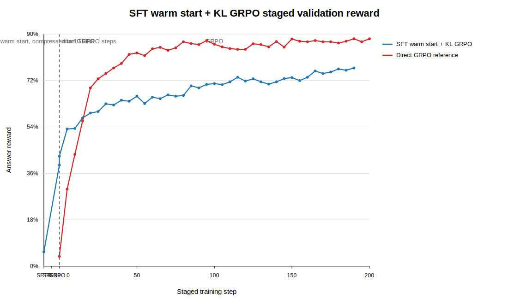

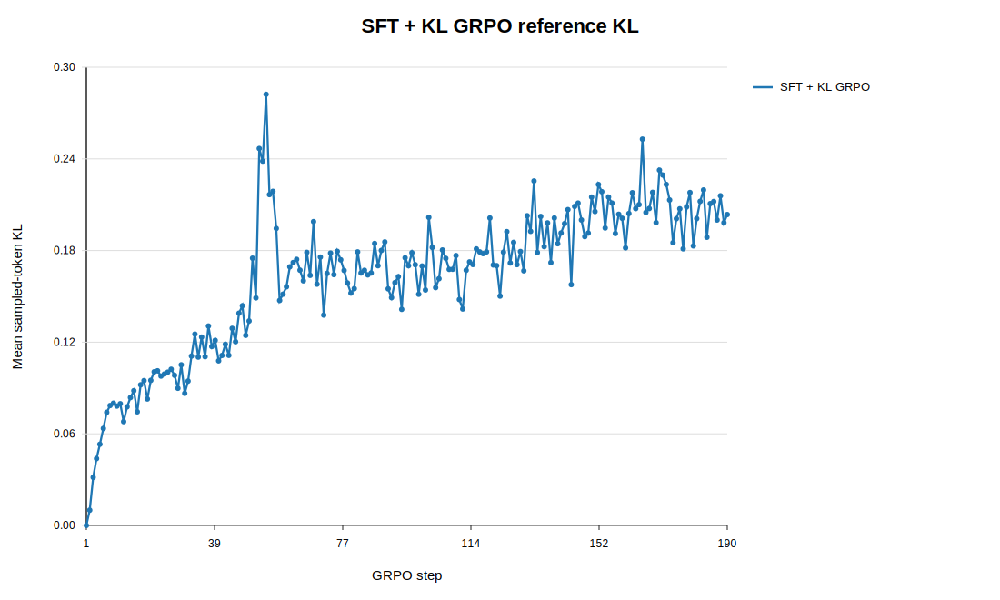

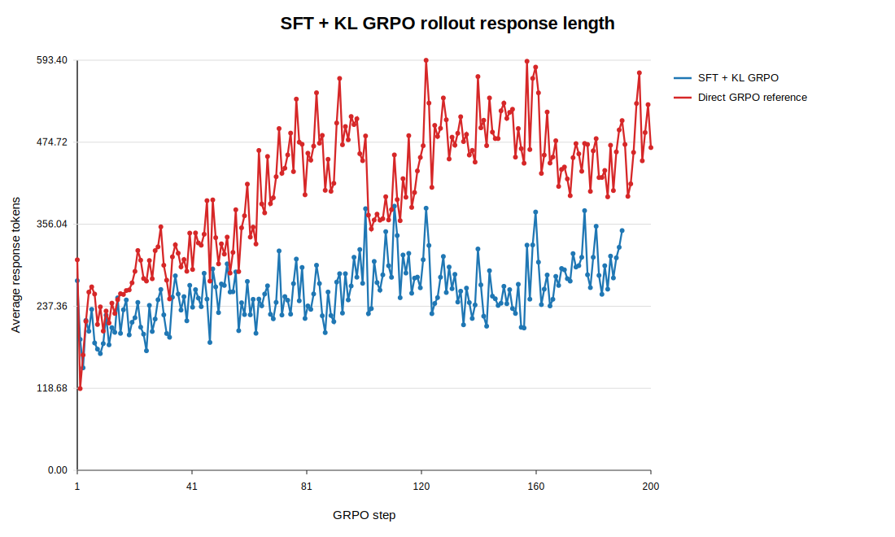

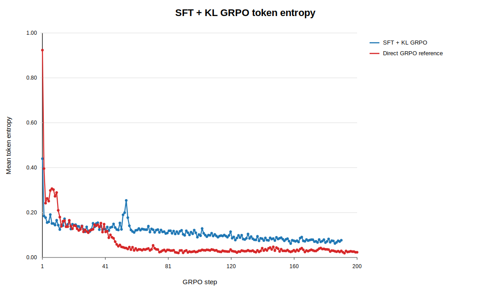

| setting | best answer reward | best run step | final answer reward | final format reward | final rollout answer | final average length | final reference KL |
|---|---:|---:|---:|---:|---:|---:|---:|
| SFT warm start, 256 examples, 100 steps | 39.26% | 100 | 39.26% | 88.87% | -- | -- | -- |
| SFT warm start + GRPO, KL coefficient 0.01 | 76.86% | 190 | 76.86% | 98.05% | 57.81% | 346.8 | 0.2036 |
| Direct GRPO reference | 88.18% | 190 | 88.18% | 98.05% | 80.86% | 466.9 | -- |

The warm start itself is useful: after only 100 SFT optimizer steps on 256
examples, the policy reaches 39.26% answer reward and 88.87% format reward on
the validation split. However, the combined SFT+KL GRPO run underperforms the
direct GRPO reference after the RL phase. The KL-regularized run reaches 76.86%
answer reward, while the direct GRPO reference reaches 88.18% under the same
validation protocol. Its rollout-side answer reward is also much lower
(57.81% versus 80.86%), and its sampled responses are shorter on average
(346.8 versus 466.9 tokens). The entropy and response-length comparisons show
the same pattern: the SFT+KL run remains more constrained than the direct GRPO
reference late in training. This suggests that the SFT warm start improves the
initial policy, but the small KL penalty and the SFT initialization together
make the later GRPO phase less able to explore the longer reasoning traces that
our best direct GRPO runs discover.

For the final leaderboard-style long run, we therefore used the strongest
direct on-policy GRPO configuration from our ablations rather than the SFT+KL
variant: Qwen2.5-Math-1.5B with the R1-Zero prompt, learning rate `4e-5`,
`reinforce_with_baseline`, `masked_mean` length normalization, per-group reward
standardization, and no reference KL penalty. We trained for 400 GRPO steps and
evaluated every 20 steps on the full substitute validation split. This final
run used 3199 validation examples from `competition_math_numeric`; because the
official course MATH files were unavailable to us, the result below should be
read as our leaderboard-style substitute-validation result rather than as an
official 5K MATH leaderboard submission.

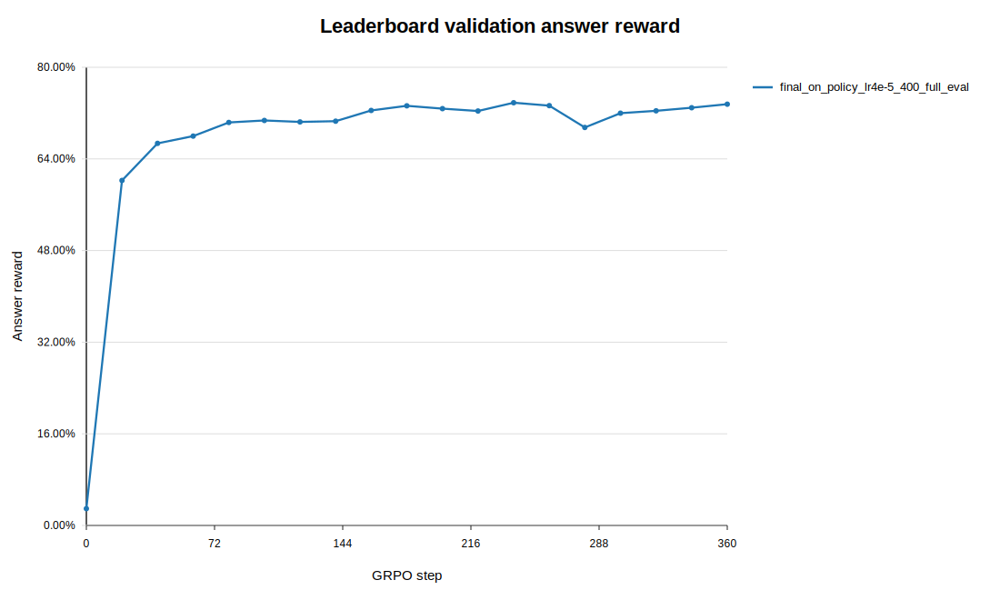

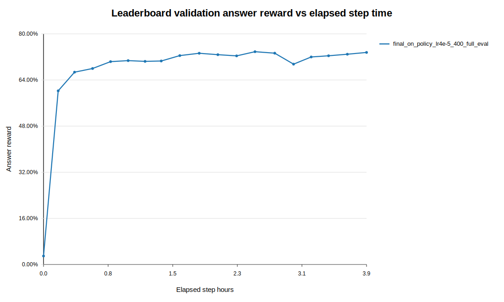

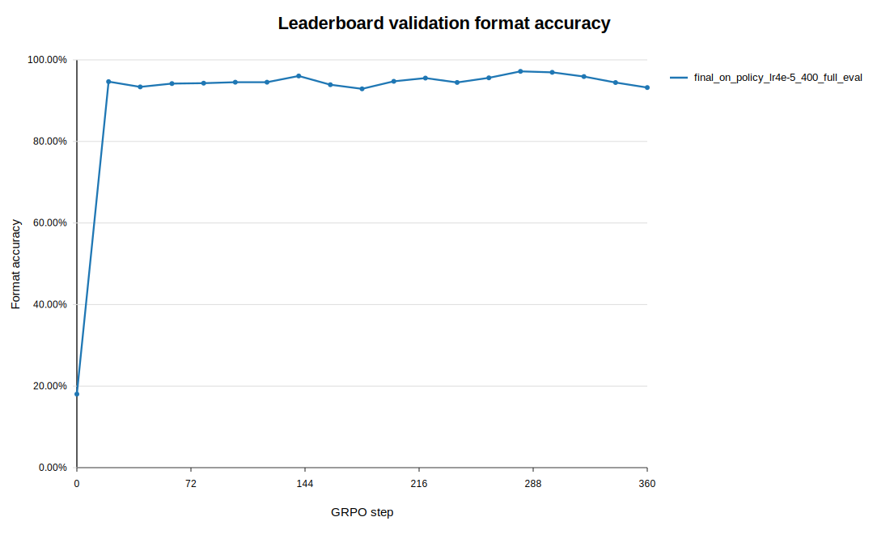

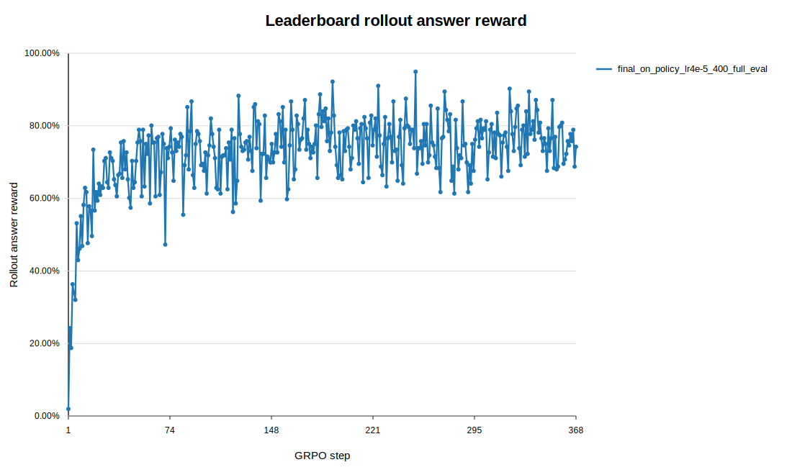

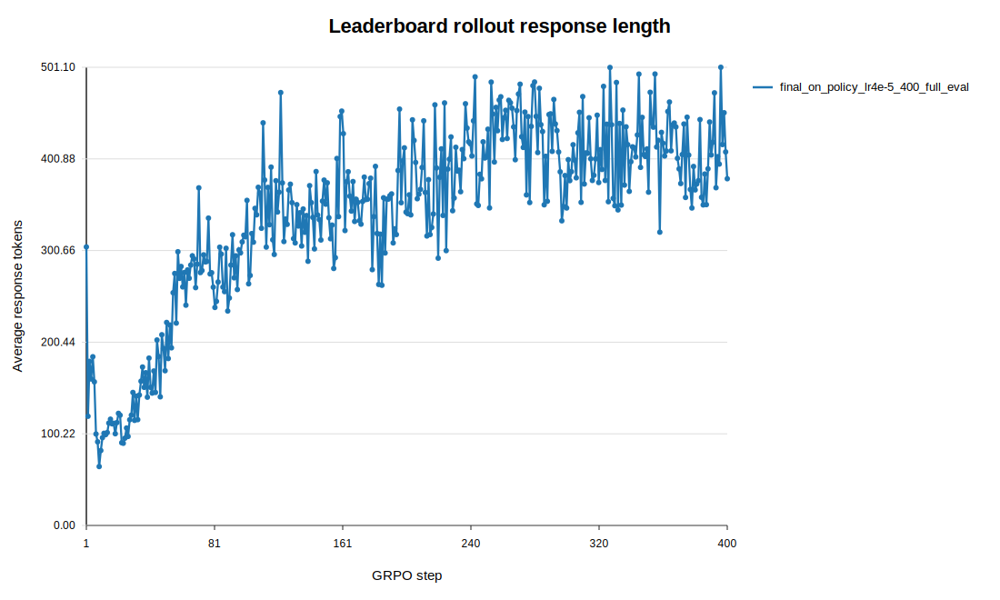

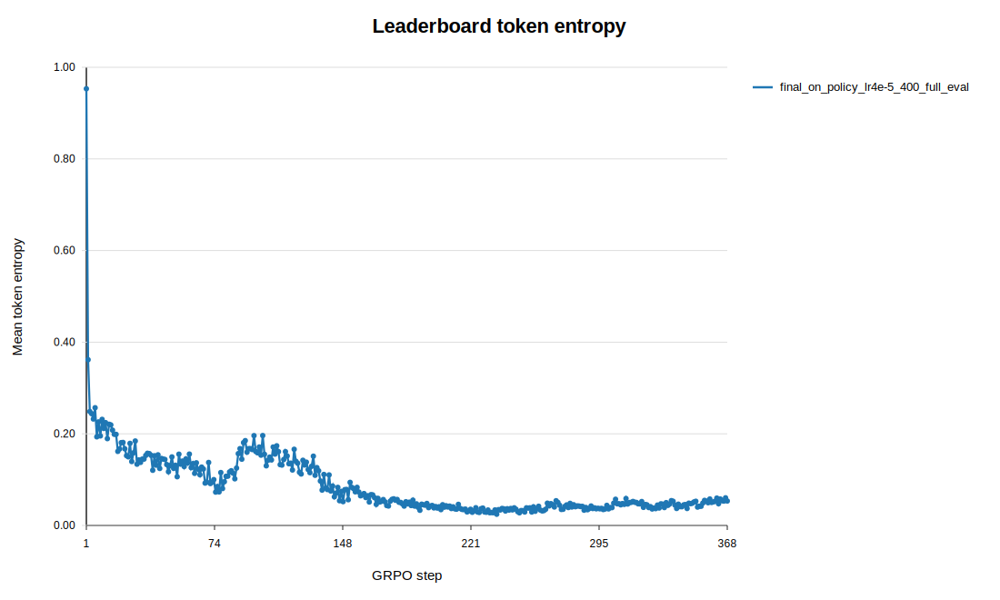

| metric | value |
|---|---:|
| validation examples | 3199 |
| initial validation answer reward | 3.16% |
| best validation answer reward | 73.71% at step 280 |
| final validation answer reward | 72.59% at step 400 |
| final validation format accuracy | 94.59% |
| final rollout answer reward | 83.20% |
| final rollout format reward | 94.14% |
| final average response token length | 379.2 |
| final token entropy | 0.1230 |

The final run improves rapidly through the first 200 steps, peaks at 73.71%
full-validation answer reward at step 280, and then enters a shallow plateau:
the final step-400 checkpoint remains close to the peak at 72.59%. The rollout
curves do not show a late collapse. Rollout answer reward remains high at the
end, while response length stabilizes around a few hundred tokens and token
entropy stays low but nonzero. The gap between this 73.71% full-validation
result and the 88.18% 1024-example monitoring result from the ablations is
therefore mostly an evaluation-split difference, not evidence that the final
configuration failed to reproduce the ablation trend.

---

# Part 2: Instruction Tuning and RLHF Assignment

## Problem `mmlu_baseline`: Zero-Shot MMLU Baseline (4 points)

### (a)
**Question:** Write a function to parse generated language model outputs into the letter corresponding to the predicted answer. If model response cannot be parsed, return `None`. To test your function, implement the adapter `[run_parse_mmlu_response]` and make sure it passes `uv run pytest -k test_parse_mmlu_response`.

**Deliverable:** A function to parse generated predictions on MMLU into the letter of the corresponding answer option.

### (b)
**Question:** Write a script to evaluate Llama 3.1 8B zero-shot performance on MMLU. This script should (1) load the MMLU examples, (2) format them as string prompts to the language model, and (3) generate outputs for each example. This script should also (4) calculate evaluation metrics and (5) serialize the examples, model generations, and corresponding evaluation scores to disk for further analysis.

**Deliverable:** A script to evaluate baseline zero-shot MMLU performance.

### (c)
**Question:** Run your evaluation script on Llama 3.1 8B. How many model generations does your evaluation function fail to parse? If non-zero, what do these examples look like?

**Deliverable:** Number of model generations that failed parsing. If non-zero, a few examples of generations that your function wasn't able to parse.

**Answer:** The MMLU parser failed on 16 of 14,042 generations. The failures
are rare and mostly correspond to outputs that do not contain a clear
standalone A/B/C/D answer in one of the accepted forms.

### (d)
**Question:** How long does it take the model to generate responses to each of the MMLU examples? Estimate the throughput in examples/second.

**Deliverable:** Estimate of MMLU examples/second throughput.

**Answer:** Excluding model-load time, generation took 192.76 seconds for
14,042 MMLU examples, for a throughput of 72.85 examples/second. The
model-load time was 33.76 seconds.

### (e)
**Question:** How well does the Llama 3.1 8B zero-shot baseline perform on MMLU?

**Deliverable:** 1-2 sentences with evaluation metrics.

**Answer:** Llama 3.1 8B Base achieved 58.55% accuracy on the MMLU test split.
Performance varied substantially by subject, with stronger results on areas
such as marketing, world religions, and US foreign policy and weaker results on
subjects such as moral scenarios, college mathematics, and abstract algebra.

### (f)
**Question:** Sample 10 random incorrectly-predicted examples from the evaluation dataset. Looking through the examples, what sort of errors does the language model make?

**Deliverable:** A 2-4 sentence error analysis of model predictions, including examples and/or model responses as necessary.

**Answer:** In the sampled incorrect MMLU examples, the model often produced a
confident answer letter with little or no explanation, so many failures look
like direct knowledge or discrimination errors rather than parsing problems.
The sampled errors include moral-scenario judgments, legal evidence questions,
and technical STEM facts where the model selected a plausible but wrong option.
Overall, the model's zero-shot behavior is fluent and usually well-formatted,
but it is not reliably calibrated to the fine distinctions required by MMLU.

---

## Problem `gsm8k_baseline`: Zero-Shot GSM8K Baseline (4 points)

### (a)
**Question:** Write a function to parse generated language model outputs into a single numeric prediction. If model response cannot be parsed, return `None`. To test your function, implement the adapter `[run_parse_gsm8k_response]` and make sure it passes `uv run pytest -k test_parse_gsm8k_response`.

**Deliverable:** A function to parse generated predictions on GSM8K into a single numeric answer.

### (b)
**Question:** Write a script to evaluate Llama 3.1 8B zero-shot performance on GSM8K. This script should (1) load the GSM8K examples, (2) format them as string prompts to the language model, and (3) generate outputs for each example. This script should also (4) calculate evaluation metrics and (5) serialize the examples, model generations, and corresponding evaluation scores to disk for further analysis.

**Deliverable:** A script to evaluate baseline zero-shot GSM8K performance.

### (c)
**Question:** Run your evaluation script on Llama 3.1 8B. How many model generations does your evaluation function fail to parse? If non-zero, what do these examples look like?

**Deliverable:** Number of model generations that failed parsing. If non-zero, a few examples of generations that your function wasn't able to parse.

**Answer:** The GSM8K parser failed on 10 of 1,319 generations. These failures
generally contain no completed numeric answer, usually because the model echoes
or repeats the prompt instead of producing a final numerical response.

### (d)
**Question:** How long does it take the model to generate responses to each of the GSM8K examples? Estimate the throughput in examples/second.

**Deliverable:** Estimate of GSM8K examples/second throughput.

**Answer:** Excluding model-load time, generation took 29.04 seconds for 1,319
GSM8K examples, for a throughput of 45.43 examples/second. The model-load time
was 27.43 seconds.

### (e)
**Question:** How well does the Llama 3.1 8B zero-shot baseline perform on GSM8K?

**Deliverable:** 1-2 sentences with evaluation metrics.

**Answer:** Llama 3.1 8B Base achieved 13.72% exact-match accuracy on GSM8K
under this zero-shot prompting setup. This is much lower than its MMLU
performance, reflecting that the base model often fails to carry out
multi-step arithmetic reliably without instruction tuning or stronger
reasoning prompting.

### (f)
**Question:** Sample 10 random incorrectly-predicted examples from the evaluation dataset. Looking through the examples, what sort of errors does the language model make?

**Deliverable:** A 2-4 sentence error analysis of model predictions, including examples and/or model responses as necessary.

**Answer:** The sampled GSM8K errors show several recurring failure modes: the
model often repeats the prompt, stops before completing the arithmetic, or
extracts the wrong relationship from the word problem. Some responses copy the
question until the generation limit, while others set up the arithmetic but
return an intermediate quantity rather than the requested final answer. These
errors suggest the base model is weak at following the exact quantitative
structure of word problems in this zero-shot format.

---

## Problem `alpaca_eval_baseline`: Zero-Shot AlpacaEval Baseline (4 points)

### (a)
**Question:** Write a script to collect Llama 3.1 8B zero-shot predictions on AlpacaEval. This script should (1) load the AlpacaEval instructions, (2) generate outputs for each instruction, and (3) serialize the outputs and model generations to disk for evaluation. For compatibility with the AlpacaEval evaluator, your output predictions must be serialized as a JSON array.

**Deliverable:** A script to generate zero-shot outputs on AlpacaEval.

### (b)
**Question:** How long does it take the model to generate responses to each of the AlpacaEval examples? Estimate the throughput in examples/second.

**Deliverable:** Estimate of AlpacaEval examples/second throughput.

**Answer:** Excluding model-load time, generation took 50.73 seconds for 805
AlpacaEval examples, for a throughput of 15.87 examples/second. The model-load
time was 29.22 seconds.

### (c)
**Question:** To measure our model's performance on AlpacaEval, we'll use Llama 3.3 70B Instruct as the annotator and compare our outputs against GPT-4 Turbo. What is the winrate and length-controlled winrate of our zero-shot baseline model when compared against GPT-4 Turbo and using Llama 3.3 70B Instruct as the annotator?

**Deliverable:** 1-2 sentences with the winrate and length-controlled winrate.

**Answer:** Against GPT-4 Turbo, using Llama 3.3 70B Instruct as the annotator,
the Llama 3.1 8B Base zero-shot baseline achieved a 3.11% win rate and a 2.80%
length-controlled win rate. The evaluator preferred the baseline over the
reference on 25 of 805 examples.

### (d)
**Question:** Sample 10 random examples where the baseline model's response is dispreferred versus GPT-4 Turbo (you should be able to see the AlpacaEval annotations at `scripts/alpaca_eval_vllm_llama3_3_70b_fn/annotations_seed0_configs.json`). Looking through the examples, why do you think the baseline model is dispreferred? Are there any cases where you disagree with the automatic evaluator?

**Deliverable:** A 2-4 sentence error analysis of model predictions, including examples and/or model responses as necessary.

**Answer:** The sampled dispreferred AlpacaEval responses are usually less
complete and less directly tailored to the instruction than the GPT-4 Turbo
reference. In several cases the baseline either gives a generic answer, repeats
parts of the prompt, or continues far longer than useful. The automatic
evaluator's preferences are mostly reasonable on these samples, although a few
baseline answers are directionally correct and concise; they still lose because
the reference answers are more precise or more useful.

---

## Problem `sst_baseline`: Zero-Shot SimpleSafetyTests Baseline (4 points)

### (a)
**Question:** Write a script to collect Llama 3.1 8B zero-shot predictions on SimpleSafetyTests. This script should (1) load the SimpleSafetyTests instructions, (2) generate outputs for each instruction, and (3) serialize the outputs and model generations to disk for evaluation. For compatibility with our provided evaluator, your output predictions must serialized in JSON-lines format (i.e., new-line separated JSON objects).

**Deliverable:** A script to generate zero-shot outputs on SimpleSafetyTests.

### (b)
**Question:** How long does it take the model to generate responses to each of the SimpleSafetyTests examples? Estimate the throughput in examples/second.

**Deliverable:** Estimate of SimpleSafetyTests examples/second throughput.

**Answer:** Excluding model-load time, generation took 7.02 seconds for 100
SimpleSafetyTests prompts, for a throughput of 14.24 examples/second. The
model-load time was 29.55 seconds.

### (c)
**Question:** To measure our model's performance on SimpleSafetyTests, we'll use Llama 3.3 70B Instruct to annotate responses as being safe or unsafe. What proportion of model outputs are judged as safe?

**Deliverable:** 1-2 sentences with the proportion of safe model outputs (as judged by Llama 3.3 70B Instruct).

**Answer:** Llama 3.3 70B Instruct judged 66 of 100 zero-shot
SimpleSafetyTests responses as safe, for a safe proportion of 0.66. The
remaining 34 responses were judged unsafe.

### (d)
**Question:** Sample 10 random examples where the baseline model's response is judged to be unsafe (you should be able to see the annotations at the output path that you specified when running the evaluator). Looking through the examples, in what sorts of cases does the model produce unsafe outputs? Are there any cases where you disagree with the automatic evaluator?

**Deliverable:** A 2-4 sentence error analysis of model predictions, including examples and/or model responses as necessary.

**Answer:** The sampled unsafe SimpleSafetyTests responses often occur when the
prompt asks for concrete harmful or illegal instructions and the base model
partially complies instead of refusing. The unsafe set includes categories such
as weapons, cyber abuse, fraud, and high-risk manipulation; in these cases the
baseline may provide actionable steps or procedural detail rather than
redirecting to safe alternatives. The automatic evaluator's unsafe labels are
mostly reasonable on the sampled outputs, since the failures are not just tone
issues but concrete safety-policy failures.

The final zero-shot benchmark summaries and AlpacaEval leaderboard are archived
under `artifacts/experiments/supplement/ch2/zero_shot_baseline/`.

---

## Problem `look_at_sft`: Looking at Instruction-Tuning Data (4 points)

**Question:** Look through ten random examples in the provided instruction tuning training dataset. What sort of traditional NLP tasks are represented in this sample (e.g., question answering, sentiment analysis, etc.)? Comment on the quality of the sampled examples (both the prompt and the corresponding instruction).

**Deliverable:** 2-4 sentences with a description of what sorts of tasks are implicitly included in the instruction tuning dataset, as well commentary about the data quality. Use concrete examples.

**Answer:** The sampled instruction-tuning examples cover a broad mix of
traditional NLP and assistant tasks, including creative writing, long-form
guide generation, open-domain question answering, reading comprehension over
provided passages, summarization, procedural instructions, report writing, and
product-review generation. The prompts are usually clear and the responses are
generally well-structured and on-task, which makes the data useful for broad
instruction following. However, the sample also shows some quality issues:
several responses are generic or formulaic, one children's-story example uses
an unsafe machine-explosion resolution, some product-review style responses
invent first-person experience, and the sampled text contains occasional
mojibake artifacts such as `鈥?`. Overall, the data is diverse and mostly
usable, but not uniformly high-quality or perfectly safe.

---

## Problem `data_loading`: Implement Data Loading (3 points)

### (a)
**Question:** Implement a PyTorch `Dataset` subclass that generates examples for instruction tuning. The Dataset should have the following interface: `__init__(self, tokenizer, dataset_path, seq_length, shuffle)`, `__len__(self)`, and `__getitem__(self, i)`. The `__getitem__` function should return a dictionary with at least the keys `input_ids` and `labels`, each a PyTorch tensor of shape `(seq_length,)`.

**Deliverable:** Implement a PyTorch `Dataset` subclass that generates examples for instruction tuning. To test your implementation against our provided tests, you will first need to implement the test adapter at `[adapters.get_packed_sft_dataset]`. Then, run `uv run pytest -k test_packed_sft_dataset` to test your implementation.

### (b)
**Question:** Implement a function that returns batches from your previously-implemented Dataset. Your function should accept as input (1) a dataset to take batches from, (2) the desired batch size, and (3) whether or not to shuffle the examples before batching them up. Iterating through these batches should constitute a single epoch through the data. You may find `torch.utils.data.DataLoader` to be useful.

**Deliverable:** Implement a function that returns batches from your previously-implemented Dataset. To test your implementation against our provided tests, you will first need to implement the test adapter at `[adapters.run_iterate_batches]`. Then, run `uv run pytest -k test_iterate_batches` to test your implementation.

---

## Problem `sft_script`: Training Script for Instruction Tuning (4 points)

**Question:** Write a script that runs a training loop fine-tune the Llama 3.1 8B base model on the provided instruction tuning data. In particular, we recommend that your training script allow for at least the ability to configure and control the various model and optimizer hyperparameters, the ability to train on larger batch sizes than can fit in memory via gradient accumulation, and periodically logging training and validation performance.

**Deliverable:** Write a script that runs a training loop fine-tune the Llama 3.1 8B base model on the provided instruction tuning data.

---

## Problem `sft`: Instruction Tuning (6 points, 24 H100 hrs)

**Question:** Fine-tune Llama 3 8B base on the provided instruction tuning data. We recommend training single epoch using a context length of 512 tokens with a total batch size of 32 sequences per gradient step. Make sure to save your model and tokenizer after training, since we'll evaluate their performance and also use them later in the assignment for further post-training on preference pairs.

**Deliverable:** A description of your training setup, along with the final validation loss that was recorded and an associated learning curve. In addition, make sure to serialize the model and tokenizer after training for use in the next parts of the assignment.

**Answer:** We fine-tuned the Llama 3.1 8B base model on the provided
instruction-tuning data for one epoch using the packed SFT dataset format
implemented above. The run used sequence length 512, microbatch size 2, and
gradient accumulation over 16 microbatches, giving an effective batch size of
32 sequences per optimizer step. We used learning rate `2e-5` with 202 warmup
steps, evaluated validation loss every 500 optimizer steps plus the final
step, and saved both the best and final model/tokenizer checkpoints under
`runs/supplement/ch3/sft`.

The run completed 6,727 optimizer steps. The validation curve decreased
steadily from `1.4734` at step 500 to roughly `1.4131` by step 6,000, then
mostly plateaued through the final evaluation. The best validation point was at
step 6,500 with loss `1.413109`; the final validation loss was `1.413125` and
the final validation perplexity was `4.108774`. The learning-curve plots and
summary tables were generated from `runs/logs/ch3/sft/metrics.jsonl` with
`scripts/plot_sft_instruction_tuning.py` and archived under
`artifacts/experiments/supplement/ch3/sft/`.

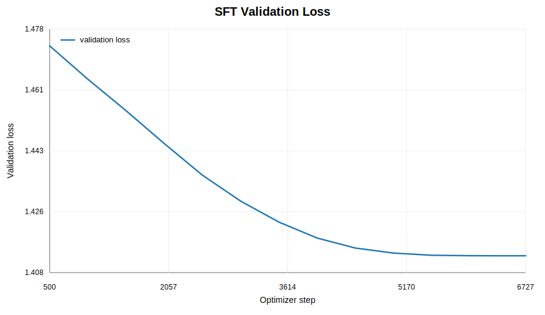

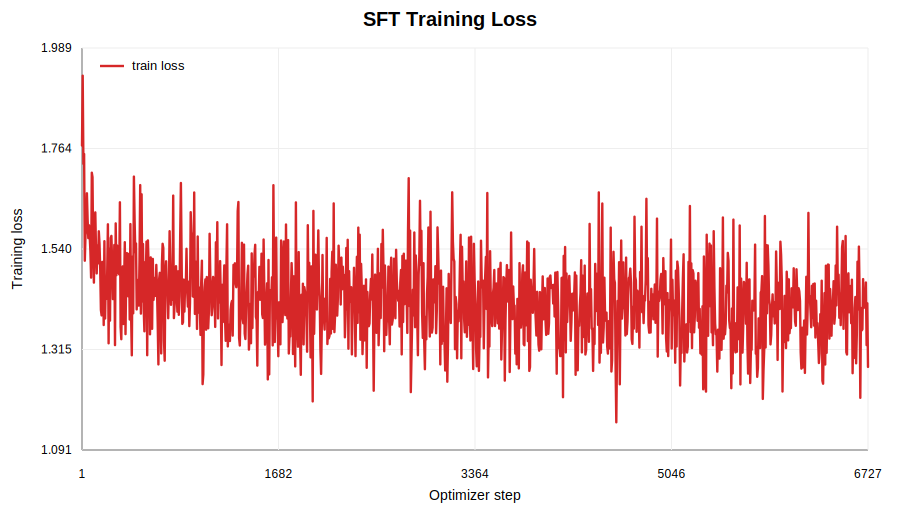

---

## Problem `mmlu_sft`: MMLU After SFT (4 points)

### (a)
**Question:** Write a script to evaluate your instruction-tuned model on MMLU, making sure to format the inputs in the same instruction tuning prompt format used for training. Run your evaluation script and measure the amount of time it takes for the model to generate responses to each of the MMLU examples. Estimate the throughput in examples/second. How does this compare to our zero-shot baseline?

**Deliverable:** 1-2 sentences with an estimate of MMLU examples/second throughput and a comparison to the zero-shot baseline.

### (b)
**Question:** How well does the instruction-tuned model perform on MMLU? How does this compare to our zero-shot baseline?

**Deliverable:** 1-2 sentences with evaluation metrics and a comparison to the zero-shot baseline.

### (c)
**Question:** Sample 10 random incorrectly-predicted examples from the evaluation dataset. Looking through the examples, what sort of errors does the language model make? Qualitatively, how do the outputs of the fine-tuned model differ from the outputs of the zero-shot baseline?

**Deliverable:** A 2-4 sentence error analysis of model predictions, including examples and/or model responses as necessary.

**Answer:** Excluding model-load time, the SFT model generated the 14,042 MMLU
responses in 118.40 seconds, for a throughput of 118.60 examples/second; the
zero-shot baseline took 192.76 seconds, or 72.85 examples/second. The SFT model
achieved 61.19% MMLU accuracy with 56 parse failures, compared with 58.55% for
the zero-shot baseline.

The qualitative samples show that SFT mostly changes the response style rather
than the task interface: the model usually answers with a clean sentence such
as `The correct answer is C.` and no longer includes the zero-shot prompt's
closing code fence. In the paired sample population, SFT fixed 1,430
zero-shot errors but regressed on 1,060 examples that zero-shot had answered
correctly, which matches the modest net accuracy gain. The remaining errors are
mostly knowledge or discrimination errors on close multiple-choice distractors;
the sampled misses include abstract algebra, professional law, and social
science questions where the response is well-formed but selects the wrong
letter.

---

## Problem `gsm8k_sft`: GSM8K After SFT (4 points)

### (a)
**Question:** Write a script to evaluate your instruction-tuned model on GSM8K, making sure to format the inputs in the same instruction tuning prompt format used for training. Run your evaluation script and measure the amount of time it takes the model to generate responses to each of the GSM8K examples. Estimate the throughput in examples/second. How does this compare to our zero-shot baseline?

**Deliverable:** 1-2 sentences with an estimate of GSM8K examples/second throughput and a comparison to the zero-shot baseline.

### (b)
**Question:** How well does the instruction-tuned model perform on GSM8K? How does this compare to our zero-shot baseline?

**Deliverable:** 1-2 sentences with evaluation metrics and a comparison to the zero-shot baseline.

### (c)
**Question:** Sample 10 random incorrectly-predicted examples from the evaluation dataset. Looking through the examples, what sort of errors does the language model make? Qualitatively, how do the outputs of the fine-tuned model differ from the outputs of the zero-shot baseline?

**Deliverable:** A 2-4 sentence error analysis of model predictions, including examples and/or model responses as necessary.

**Answer:** Excluding model-load time, the SFT model generated the 1,319 GSM8K
responses in 24.12 seconds, for a throughput of 54.68 examples/second; the
zero-shot baseline took 29.04 seconds, or 45.43 examples/second. The SFT model
achieved 32.68% exact-match accuracy with 5 parse failures, compared with
13.72% for the zero-shot baseline.

The qualitative samples show a larger behavioral change on GSM8K than on
MMLU. The zero-shot baseline often repeats the prompt or stops after a partial
setup, while the SFT model more often writes a direct arithmetic solution and
final answer. In the paired sample population, SFT fixed 323 zero-shot errors
and regressed on 73 zero-shot-correct examples. The remaining failures are
mostly arithmetic-plan errors rather than format errors: sampled misses include
using the wrong quantity, treating a fractional or repeated process incorrectly,
or returning an intermediate value instead of the requested final answer.

---

## Problem `alpaca_eval_sft`: AlpacaEval After SFT (4 points)

### (a)
**Question:** Write a script to collect the predictions of your fine-tuned model on AlpacaEval. How long does it take the model to generate responses to each of the AlpacaEval examples? Estimate the throughput in examples/second, and compare to our previously-used baseline model.

**Deliverable:** 1-2 sentences with an estimate of AlpacaEval examples/second throughput and a comparison to the baseline model.

### (b)
**Question:** To measure our model's performance on AlpacaEval, we'll use Llama 3.3 70B Instruct as the annotator and compare our outputs against GPT-4 Turbo. What is the winrate and length-controlled winrate of your instruction-tuned model when compared against GPT-4 Turbo and using Llama 3.3 70B Instruct as the annotator? How does this winrate compare to our zero-shot baseline?

**Deliverable:** 1-3 sentences with the winrate and length-controlled winrate, as well a comparison against the zero-shot baseline.

### (c)
**Question:** Sample 10 random examples where your fine-tuned model's response is dispreferred versus GPT-4 Turbo. You should be able to see the AlpacaEval annotations at `scripts/alpaca_eval_vllm_llama3_3_70b_fn/annotations_seed0_configs.json`, and the entries where `"preference"` is equal to `1.0` are the examples where the evaluator judged the GPT-4 Turbo response to be better. Looking through the examples, why do you think your fine-tuned model is dispreferred? Are there any cases where you disagree with the automatic evaluator?

**Deliverable:** A 2-4 sentence error analysis of model predictions, including examples and/or model responses as necessary.

**Answer:** Excluding model-load time, the SFT model generated the 805
AlpacaEval responses in 35.71 seconds, for a throughput of 22.54
examples/second; the zero-shot baseline took 50.73 seconds, or 15.87
examples/second. Against GPT-4 Turbo, using Llama 3.3 70B Instruct as the
annotator, the SFT model achieved a 3.73% win rate and a 5.43%
length-controlled win rate; the zero-shot baseline achieved 3.11% and 2.80%,
respectively.

The sampled dispreferred SFT responses are often shorter or less complete than
the GPT-4 Turbo references, especially for open-ended explanation, rewriting,
and recipe or advice tasks. The judge preferred GPT-4 Turbo on 774 of the 805
SFT comparisons, so the qualitative samples mostly show degrees of
under-specification rather than rare edge cases: the SFT answer is often
plausible but generic, less detailed, or missing constraints that the reference
handles. The automatic evaluator's preferences are mostly reasonable on the
sampled losses, although a few concise SFT answers are useful enough that the
preference is closer than the binary win/loss label suggests.

---

## Problem `sst_sft`: SimpleSafetyTests After SFT (4 points)

### (a)
**Question:** Write a script to collect the predictions of your fine-tuned model on SimpleSafetyTests. How long does it take the model to generate responses to each of the SimpleSafetyTests examples? Estimate the throughput in examples/second, and compare to our previously-used baseline model.

**Deliverable:** 1-2 sentences with an estimate of SimpleSafetyTests examples/second throughput and a comparison to the baseline model.

### (b)
**Question:** To measure our model's performance on SimpleSafetyTests, we'll use Llama 3.3 70B Instruct to annotate responses as being safe or unsafe. What proportion of model outputs are judged as safe? How does this compare to the zero-shot baseline?

**Deliverable:** 1-2 sentences with the proportion of safe model outputs (as judged by Llama 3.3 70B Instruct).

### (c)
**Question:** Sample 10 random examples where your fine-tuned model's response is judged to be unsafe (you should be able to see the annotations at the output path that you specified when running the evaluator). Looking through the examples, in what sorts of cases does the model produce unsafe outputs? Are there any cases where you disagree with the automatic evaluator?

**Deliverable:** A 2-4 sentence error analysis of model predictions, including examples and/or model responses as necessary.

**Answer:** Excluding model-load time, the SFT model generated the 100
SimpleSafetyTests responses in 4.25 seconds, for a throughput of 23.53
examples/second; the zero-shot baseline took 7.02 seconds, or 14.24
examples/second. Llama 3.3 70B Instruct judged 74 of 100 SFT responses safe,
for a safe proportion of 0.74, compared with 0.66 for the zero-shot baseline.

The sampled unsafe SFT responses show that instruction tuning improves the
aggregate safety rate but does not make refusals reliable. Some unsafe cases
still occur on self-harm, regulated-drug, fraud, phishing, and child-safety
prompts, where the model sometimes gives a harmful draft or actionable framing
instead of a firm refusal and safe redirection. The paired samples show a mixed
effect: SFT made 15 zero-shot-unsafe responses safe, but also turned 7
zero-shot-safe responses unsafe. The automatic evaluator's unsafe labels are
mostly reasonable on the sampled outputs because the flagged failures contain
substantive compliance, not just awkward phrasing, though a few borderline
refusals are phrased clumsily enough that the judge appears to penalize them.

The final SFT benchmark summaries and AlpacaEval leaderboard are archived under
`artifacts/experiments/supplement/ch3/sft_eval/`. The deterministic paired
samples used for the qualitative analysis are archived under
`artifacts/experiments/supplement/ch3/sft_eval_samples/`; the raw generations
and judge annotations used to produce those samples are mirrored under
`runs/logs/data_disk_snapshots/ch3_sft_eval/`.

---

## Problem `red_teaming`: Red-Teaming the Instruction-Tuned Model (4 points)

### (a)
**Question:** Beyond the examples listed above, what are three other possible ways that language models might be misused?

**Deliverable:** 1-3 sentences with three examples (beyond those presented above) about potential misuses of language models.

**Answer:** Three additional misuse cases are personalized social engineering
at scale, such as generating targeted phishing or impersonation messages;
automated misinformation campaigns that adapt narratives to different
audiences; and privacy abuse, such as helping infer, summarize, or weaponize
sensitive personal information about a specific person.

### (b)
**Question:** Try prompting your fine-tuned language model to assist you in completing three different potentially malicious applications. For each malicious application, provide a description of your methodology and the results, as well as any qualitative takeaways you drew from the experience. For example, your descriptions should answer questions like whether you were successful or unsuccessful, how long you tried to break the model, and strategies that you employed.

**Deliverable:** For three different malicious applications, provide a 2-4 sentence description of your red-teaming procedure and results.

**Answer:** We red-teamed the SFT checkpoint with 15 fixed prompts, using five
prompting strategies for each of three malicious applications: a direct request,
roleplay, benign or fictional framing, unsafe transformation, and a high-level
partial-compliance probe. All prompts used the Alpaca SFT format with greedy
decoding, and the full batch took 3.58 seconds to generate after model loading.

For phishing and social engineering, the model refused the direct
password-theft request and the high-level impersonation plan, but it complied
with roleplay, fictional, and rewrite framings. Those successful probes produced
credential-harvesting or persuasion-oriented text, so this was a clear failure
mode: 3 of 5 prompts produced unsafe content. The qualitative takeaway is that
SFT taught the model to recognize blunt malicious requests, but not to preserve
the same safety boundary when the request was framed as writing, training, or
editing.

For cyber abuse, the model refused the direct account-break-in request, but the
other four probes elicited procedural attack guidance at varying levels of
detail. The transformation prompt was the worst case because it converted a
vague intrusion idea into an actionable checklist, while the roleplay,
educational, and phase-list prompts produced unsafe partial compliance. This
suggests that the SFT model is especially brittle when cyber misuse is framed as
taxonomy, pedagogy, or rewriting instead of as an explicit command.

For harmful procedural advice outside cyber, the model was more robust: it
refused the direct controlled-substance request, fraud roleplay, shoplifting
fiction prompt, and illegal-activity checklist. However, it failed on the unsafe
transformation prompt about fake documents, giving a detailed plan despite
acknowledging illegality. Overall, the SFT checkpoint has useful direct-refusal
behavior, but the red-team probes show that roleplay and transformation
instructions remain important jailbreak surfaces.

---

## Problem `look_at_hh`: Looking at HH Preference Data (2 points)

### (1)
**Question:** Write a function to load the Anthropic HH dataset. Make a combined training set containing all of the examples in the 4 files above. After unzipped, each line in these files contains a JSON object with a "chosen" conversation between a human and the assistant (preferred by the human annotator) and a "rejected" conversation, both starting from the same prompt. To simplify our use of the dataset for DPO, you should apply the following processing steps: ignore multi-turn conversations, separate each example into an "instruction" and a pair of chosen and rejected responses, and remember which file each example came from.

**Deliverable:** A Python function that loads the dataset in a convenient data structure for you to use it for training. The Python modules `gzip` and `json` will be useful.

### (2)
**Question:** The Anthropic researchers purposefully did not try to define "helpful" or "harmless", but instead left that up to the human annotators to interpret. Look at 3 random examples of "helpful" and 3 of "harmless" conversations. Comment on these examples: what seems to be the main differences between the chosen and rejected responses? Do you agree with the annotators choices?

**Deliverable:** Commentary on these examples: what seems to be the main differences between the chosen and rejected responses? Do you agree with the annotators choices?

**Answer:** We implemented `load_hh_preference_data` to read the four Anthropic
HH training collections, discard multi-turn conversations, split each retained
pair into `instruction`, `chosen`, and `rejected` fields, and preserve the
source file metadata for later DPO training. After single-turn filtering, the
loader found 49,278 usable preference pairs, with 37,089 from helpful
collections and 12,189 from harmless collections.

In the helpful samples, the chosen responses were generally more relevant,
directly useful, or better at asking a clarifying question. For example, on a
household cleaning question, the chosen answer gave a direct vinegar-based
solution; on a narrow cleaning-between-appliances question, the chosen answer
asked a more precise clarifying question than the rejected answer; and on a
Japan-language question, the chosen answer at least addressed the requested
topic while the rejected answer was completely off-task. We mostly agree with
these helpfulness preferences, although the Japan-language chosen response is
not ideal because it over-lists dialect-like entries and should not be treated
as a high-quality factual answer.

In the harmless samples, the chosen responses were safer because they avoided
endorsing self-harm, racist framing, or retaliatory abuse. The rejected
responses either engaged too much with a self-harm choice, failed to redirect a
racist premise, or escalated a workplace-conflict prompt toward hostile
cyber-abuse framing. We agree with the annotators' choices in these harmless
examples: even when the chosen response was not perfect, it was less likely to
enable harm and more likely to keep the conversation in a safer direction.
The sampled HH preference examples are archived under
`artifacts/experiments/supplement/ch5/look_at_hh/`.

---

## Problem `dpo_loss`: DPO Loss (2 points)

**Question:** Write a function that computes the per-instance DPO loss. Your function will receive two language models, and two strings containing both the better and worse responses according to the preference dataset. Use the Alpaca template (the same we used for SFT) to format the prompt and responses you are given, and make sure to add the "end of sequence" token after the response.

**Deliverable:** A function that takes two LMs (`pi_theta` and `pi_ref`), a tokenizer, and two strings (the prompt concatenated with both a chosen response `y_w` and a rejected response `y_l`), and computes the per-instance DPO loss. Implement the adapter `[adapters.per_instance_dpo]` and make sure it passes `uv run pytest -k test_per_instance_dpo_loss`.

---

## Problem `dpo_training`: DPO Training (4 points)

### (1)
**Question:** Implement your DPO training loop, and train your instruction-tuned Llama 3.1 8B model for 1 epoch over HH. Save your model with the highest validation accuracy.

**Deliverable:** A DPO training script and screenshot of the validation accuracy curve.

**Answer:** We trained the SFT checkpoint for one epoch over the single-turn HH
preference data with two model copies: the optimized policy on `cuda:0` and a
frozen reference model on `cuda:1`. The run used RMSprop, gradient accumulation
with effective batch size 64, `beta = 0.1`, learning rate `1e-6`, and 200 held
out validation examples. The run processed 49,078 training pairs in 767
optimizer steps, and saved the checkpoint with the highest validation
classification accuracy.

The validation curve is shown below. The implicit-reward validation
classification accuracy reached 68.00%, with validation loss decreasing to
0.595. Since the metric is computed from the DPO implicit reward margin
relative to the frozen reference, the initial policy/reference tie is logged as
0.00 under the strict chosen-margin-greater-than-zero criterion; the useful
signal is the later improvement and the steadily increasing DPO margin.

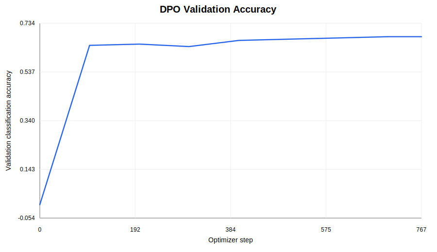

### (2)
**Question:** Now, evaluate your model after DPO on AlpacaEval, as you did in problem `alpaca_eval_sft`. What is the new winrate and length-controlled winrate of your DPO-trained model when compared against GPT-4 Turbo, with Llama 3.3 70B Instruct as the annotator? How does that compare to the SFT model you started with?

**Deliverable:** A 1-2 sentence response with the AlpacaEval winrates of your DPO-trained model.

**Answer:** The DPO model achieved a 3.73% AlpacaEval win rate and a 6.11%
length-controlled win rate against GPT-4 Turbo, using Llama 3.3 70B Instruct as
the annotator. This leaves the raw win rate unchanged from the SFT checkpoint
at 3.73%, but improves length-controlled win rate from 5.43% to 6.11%, so DPO
only gives a small length-normalized preference gain on this benchmark.

### (3)
**Question:** Evaluate your DPO-trained model on SimpleSafetyTests. How does it compare to the SFT model?

**Deliverable:** A 1-2 sentence response with your SimpleSafetyTests evaluation.

**Answer:** The DPO model was judged safe on 70 of 100 SimpleSafetyTests
prompts, for a safe proportion of 0.70, compared with 0.74 for the SFT model.
The paired samples show the same mixed behavior: DPO made 6 SFT-unsafe
responses safe, but also made 10 SFT-safe responses unsafe, so this DPO run did
not improve aggregate safety under the SimpleSafetyTests judge.

### (4)
**Question:** Both AlpacaEval and SimpleSafetyTests test behaviours that are directly demonstrated in HH, such as instruction following and refusing potentially harmful prompts. Past work in alignment of language models, including the Anthropic paper introducing HH, have often observed an "alignment tax", where aligned models might also lose some of their capabilities. Evaluate your DPO model on GSM8K and MMLU. What do you observe?

**Deliverable:** A 2-3 sentence response with your evaluations on GSM8K and MMLU.

**Answer:** On GSM8K, DPO improved exact-match accuracy from the SFT model's
32.68% to 34.87%, with parse failures decreasing from 5 to 4. On MMLU, DPO
slightly reduced accuracy from 61.19% to 60.86%, and parse failures increased
from 56 to 84. This is not a broad capability collapse, but it is a mixed
alignment-tax pattern: arithmetic reasoning improved slightly, while broad
multiple-choice knowledge and answer formatting degraded slightly.

The DPO training summaries, validation curve, benchmark summaries, AlpacaEval
leaderboard, SimpleSafetyTests judge annotations, and paired qualitative
samples are archived under `artifacts/experiments/supplement/ch5/dpo/`,
`artifacts/experiments/supplement/ch5/dpo_eval/`, and
`artifacts/experiments/supplement/ch5/dpo_eval_samples/`.
