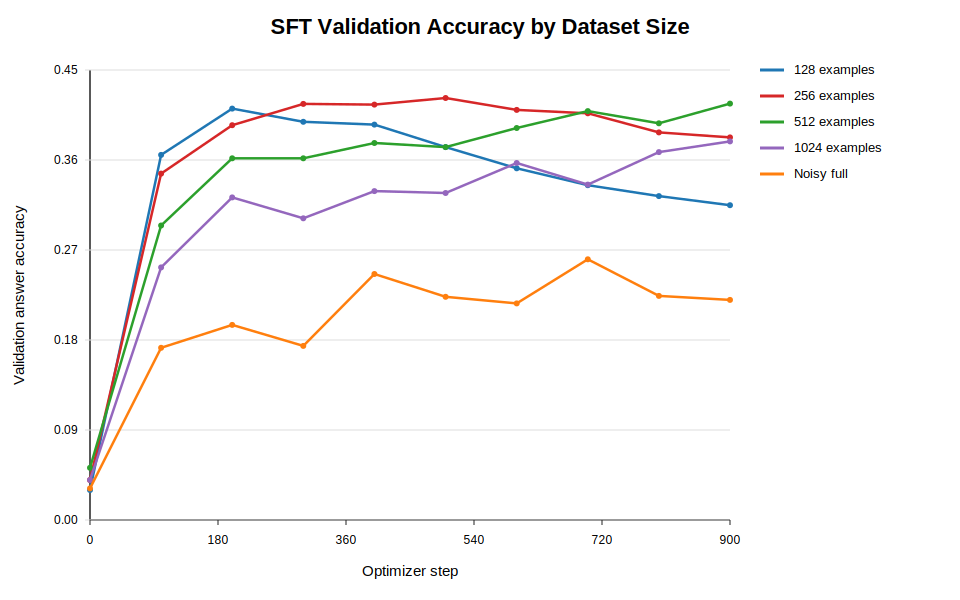
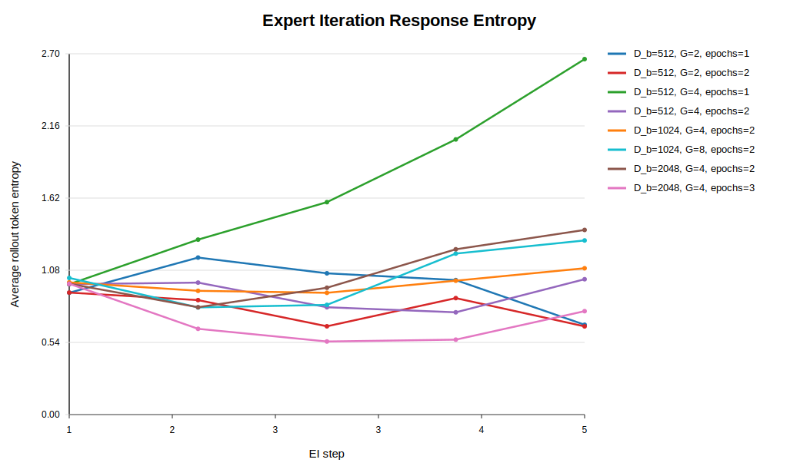
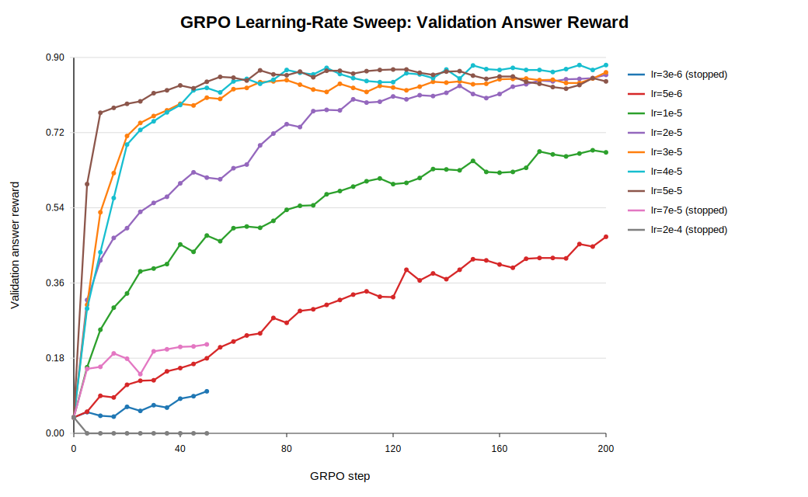
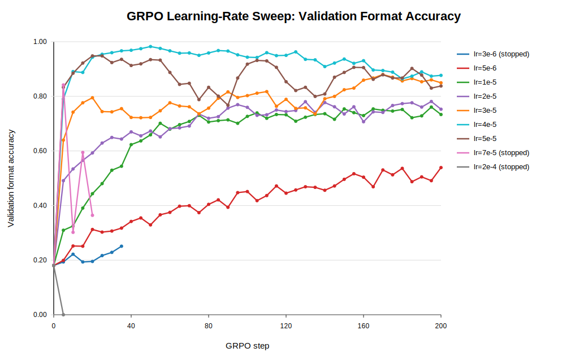

# Part 1: Reasoning RL Assignment

## Problem `math_baseline`: Zero-Shot MATH Baseline (4 points)

### (a)
**Question:** Write a script to evaluate Qwen 2.5 Math 1.5B zero-shot performance on MATH. This script should (1) load the MATH validation examples from `/data/a5-alignment/MATH/validation.jsonl`, (2) format them as string prompts to the language model using the `r1_zero` prompt, and (3) generate outputs for each example. This script should also (4) calculate evaluation metrics and (5) serialize the examples, model generations, and corresponding evaluation scores to disk for analysis in subsequent problems.

**Deliverable:** A script to evaluate baseline zero-shot MATH performance.

### (b)
**Question:** Run your evaluation script on Qwen 2.5 Math 1.5B. How many model generations fall into each of the following categories: (1) correct with both format and answer reward 1, (2) format reward 1 and answer reward 0, (3) format reward 0 and answer reward 0? Observing at least 10 cases where format reward is 0, do you think the issue is with the base model's output, or the parser? Why? What about in (at least 10) cases where format reward is 1 but answer reward is 0?

**Deliverable:** Commentary on the model and reward function performance, including examples of each category.

**Answer:** Because the official course MATH validation set was unavailable in our
self-hosted environment, we ran this analysis on the converted
`competition_math_numeric` MATH-like validation set. Out of 3,199 generations,
104 had both `format_reward = 1` and `answer_reward = 1`, 459 had
`format_reward = 1` and `answer_reward = 0`, and 2,636 had both rewards equal
to 0. We archived the summary and sampled examples under
`artifacts/experiments/ch3/3_2_math_baseline/`.

In the inspected `format_reward = 0` examples, the main issue was usually model
behavior under the strict R1-Zero output protocol rather than a vLLM failure.
Many responses contained relevant mathematical reasoning, and sometimes even
the correct numeric answer, but failed the exact parser format by using malformed
or nonstandard tags, omitting `</think>`, failing to close `</answer>`, or
writing an answer outside the required `</think> <answer> ... </answer>`
pattern. For example, some sampled generations used `<end think>` instead of
`</think>`, wrote `<answer>` without a closing `</answer>`, or produced the
correct boxed answer without any R1-Zero answer block. In the inspected
`format_reward = 1, answer_reward = 0` examples, the failures were mixed: some
were genuine reasoning errors, while others contained the correct value inside a
longer natural-language answer that the grader did not parse as equivalent to
the short ground-truth answer. Overall, this baseline suggests that the base
model can often reason in the right direction, but it is not reliable at
producing the strict answer format required by `r1_zero_reward_fn`.

### (c)
**Question:** How well does the Qwen 2.5 Math 1.5B zero-shot baseline perform on MATH?

**Deliverable:** 1-2 sentences with evaluation metrics.

**Answer:** Since the official course MATH validation set was unavailable in our
self-hosted environment, we report the zero-shot baseline on the converted
`competition_math_numeric` MATH-like validation set rather than the official
MATH validation set. On this substitute validation set, Qwen 2.5 Math 1.5B
achieved 3.25% reward accuracy, 17.60% format accuracy, and 3.25% answer
accuracy under the R1-Zero prompt with `r1_zero_reward_fn`.

---

## Problem `tokenize_prompt_and_output`: Prompt and Output Tokenization (2 points)

### Implementation
**Question:** Tokenize the prompt and output strings, and construct a mask that is 1 for the response tokens and 0 for other tokens (prompt or padding).

**Deliverable:** Implement a method `tokenize_prompt_and_output` that tokenizes the question and output separately, concatenates them together, and constructs a `response_mask`. The following interface is recommended: `def tokenize_prompt_and_output(prompt_strs, output_strs, tokenizer): Tokenize the prompt and output strings, and construct a mask that is 1 for the response tokens and 0 for other tokens (prompt or padding).` To test your code, implement `[adapters.run_tokenize_prompt_and_output]`. Then, run the test with `uv run pytest -k test_tokenize_prompt_and_output` and make sure your implementation passes it.

---

## Problem `compute_entropy`: Per-Token Entropy (1 point)

### Implementation
**Question:** Get the entropy of the next-token predictions (i.e., entropy over the vocabulary dimension).

**Deliverable:** Implement a method `compute_entropy` that computes the per-token entropy of next-token predictions. Note: you should use a numerically stable method (e.g., using `logsumexp`) to avoid overflow. To test your code, implement `[adapters.run_compute_entropy]`. Then run `uv run pytest -k test_compute_entropy` and ensure your implementation passes.

---

## Problem `get_response_log_probs`: Response Log-Probabilities and Entropy (2 points)

### Implementation
**Question:** Getting log-probabilities from a model. Obtaining log-probabilities from a model is a primitive that we will need in both SFT and RL. You will want to use a numerically stable method to compute this, and are free to use methods from `torch.nn.functional`. We also suggest including an argument to optionally compute and return token entropies.

**Deliverable:** Implement a method `get_response_log_probs` that gets per-token conditional log-probabilities (given the previous tokens) from a causal language model, and optionally the entropy of the model's next-token distribution. To test your code, implement `[adapters.run_get_response_log_probs]`. Then run `uv run pytest -k test_get_response_log_probs` and ensure the test passes.

---

## Problem `masked_normalize`: Masked Normalize (1 point)

### Implementation
**Question:** Sum over a dimension and normalize by a constant, considering only those elements where `mask == 1`.

**Deliverable:** Implement a method `masked_normalize` that sums over tensor elements and normalizes by a constant while respecting a boolean mask. To test your code, implement `[adapters.run_masked_normalize]`. Then run `uv run pytest -k test_masked_normalize` and ensure it passes.

---

## Problem `sft_microbatch_train_step`: SFT Microbatch Train Step (3 points)

### Implementation
**Question:** Execute a forward-and-backward pass on a microbatch.

**Deliverable:** Implement a single micro-batch update for SFT, including cross-entropy loss, summing with a mask, and gradient scaling. To test your code, implement `[adapters.run_sft_microbatch_train_step]`. Then run `uv run pytest -k test_sft_microbatch_train_step` and confirm it passes.

---

## Problem `log_generations`: Logging Generations (1 point)

### Implementation
**Question:** Logging generations in-the-loop. It’s always good practice to do some in-the-loop logging that involves generation from your model, and reasoning SFT/RL is no exception. Write a function `log_generations` that will prompt your model to generate responses for some given prompts (e.g., sampled from the validation set). It’s a good idea to log at least the following for each example: the input prompt, the response generated by the SFT/RL model, the ground-truth answer, the reward information, including format, answer, and total reward, the average token entropy of the response, and the average response length, average response length for correct responses, and average response length for incorrect responses.

**Deliverable:** Implement a function `log_generations` that can be used to log generations from your model.

---

## Problem `sft_experiment`: Run SFT on MATH (2 points, 2 H100 hrs)

### (1)
**Question:** Run SFT on the reasoning SFT examples (provided in `/data/a5-alignment/MATH/sft.jsonl`) using the Qwen 2.5 Math 1.5B base model, varying the number of unique examples for SFT in the range `{128, 256, 512, 1024}`, along with using the full dataset. Tune the learning rate and batch size to achieve at least 15% validation accuracy when using the full dataset.

**Deliverable:** Validation accuracy curves for different dataset sizes.

### (2)
**Question:** Filter the reasoning SFT examples to only include examples that produce the correct answer. Run SFT on the (full) filtered dataset and report the size of the filtered dataset and the validation accuracy you achieve. Compare your findings to the previous SFT experiment.

**Deliverable:** Report the size of the dataset and the validation accuracy curve you achieve.

**Answer:** The official `/data/a5-alignment/MATH` files were not available in
our self-hosted environment, so I ran this experiment on the converted
`competition_math_numeric` MATH-like substitute dataset. I used the noisy SFT
split from this substitute data for the dataset-size sweep, and used the reward
function to construct a filtered version for the second experiment. The reward
filter removed 730 of 4,866 examples, so the observed contamination rate in
this noisy SFT split was about 15.0%. All runs used Qwen2.5-Math-1.5B,
effective batch size 16, microbatch size 4, gradient accumulation 4, learning
rate `5e-5`, synchronous vLLM validation every 100 optimizer steps, and 900
optimizer steps total.

The validation accuracy curves for the SFT dataset-size sweep are shown below.

The main results are:

| setting | train examples | effective epochs | best answer acc | best step | final answer acc | final step |
|---|---:|---:|---:|---:|---:|---:|
| 128 | 128 | 112.5 | 41.14% | 200 | 31.48% | 900 |
| 256 | 256 | 56.2 | 42.20% | 500 | 38.26% | 900 |
| 512 | 512 | 28.1 | 41.64% | 900 | 41.64% | 900 |
| 1024 | 1024 | 14.1 | 37.86% | 900 | 37.86% | 900 |
| Noisy full | 4866 | 3.0 | 26.07% | 700 | 22.01% | 900 |

The 256-example run achieved the highest peak validation answer accuracy,
42.20% at step 500, but then declined to 38.26% by step 900. The 512-example
run was the best final checkpoint, reaching 41.64% at step 900. The 128-example
run peaked early at 41.14% and then degraded substantially, which suggests
overfitting under a fixed 900-step training budget. The full noisy dataset
still exceeded the assignment's 15% target, reaching 26.07% at best, but it
underperformed the smaller subsets.

For the filtered SFT experiment, filtering retained 4,136 of the 4,866 noisy
SFT examples. The filtered-vs-noisy validation curve is shown below.

The comparison is:

| setting | train examples | best answer acc | best step | final answer acc | final step |
|---|---:|---:|---:|---:|---:|
| Noisy full | 4866 | 26.07% | 700 | 22.01% | 900 |
| Filtered full | 4136 | 35.79% | 800 | 35.10% | 900 |

Reward filtering improved the best validation answer accuracy by 9.72
percentage points, from 26.07% to 35.79%, and improved final validation answer
accuracy by 13.10 points, from 22.01% to 35.10%. This supports the filtering
hypothesis in the assignment: SFT traces whose final answers fail the reward
function are harmful enough that removing them produces a substantially better
supervised warm start.

The size-sweep results should be interpreted carefully because the optimizer
step budget was fixed across dataset sizes. Smaller datasets therefore receive
many more effective epochs than the full dataset: for example, the 128-example
run sees about 112.5 epochs, while the full noisy run sees only about 3.0.
Thus, the result does not imply that smaller datasets are inherently better;
rather, under this fixed-step budget, the small datasets fit quickly and then
begin to overfit, while the full noisy dataset is both harder and noisier.

---

## Problem `expert_iteration_experiment`: Run Expert Iteration on MATH (2 points, 6 H100 hrs)

### Experiment
**Question:** Run expert iteration on the MATH dataset (provided at `/data/a5-alignment/MATH/train.jsonl`) using the Qwen 2.5 Math 1.5B Base model, varying the number of rollouts `G` per question and the number of epochs used in the SFT step, and using `n_ei_steps = 5`. Vary the batch size for each expert iteration step (i.e., the size of `D_b`) in `{512, 1024, 2048}`. You do not need to try all possible combinations of these hyperparameters. Just enough to draw conclusions about each is fine. Log the entropy of the model's responses over training. Make sure to have vLLM terminate generations at the second answer tag `</answer>`, as done in the SFT section.

**Deliverable:** Validation accuracy curves associated with different rollout configurations. Try at least 2 different rollout counts and epoch counts.

**Deliverable:** A model that achieves validation accuracy of at least 15% on MATH.

**Deliverable:** A brief 2 sentence discussion comparing to your SFT performance, as well as performance across EI steps.

**Deliverable:** A plot of the entropy of the model's responses over training.

**Answer:** Because the official course MATH files were not available in this
environment, I ran EI on the same substitute MATH-like
`competition_math_numeric_noisy` split used in the previous experiments.
Validation was run on the full 3199-example validation set with the R1-Zero
prompt, temperature 1.0, max tokens 1024, and the `r1_zero_reward_fn`-based
answer reward.

The table below summarizes the EI runs.

| Configuration | Best answer accuracy | Best EI step | Final answer accuracy | Final EI step |
|---|---:|---:|---:|---:|
| `D_b=512, G=2, epochs=1` | 28.17% | 5 | 28.17% | 5 |
| `D_b=512, G=2, epochs=2` | 33.85% | 5 | 33.85% | 5 |
| `D_b=512, G=4, epochs=1` | 25.63% | 4 | 22.60% | 5 |
| `D_b=512, G=4, epochs=2` | 35.92% | 4 | 35.35% | 5 |
| `D_b=1024, G=4, epochs=2` | 33.14% | 5 | 33.14% | 5 |
| `D_b=1024, G=8, epochs=2` | 32.35% | 2 | 27.85% | 5 |
| `D_b=2048, G=4, epochs=2` | 34.64% | 4 | 31.35% | 5 |
| `D_b=2048, G=4, epochs=3` | **40.95%** | 3 | **40.54%** | 5 |

The best EI configuration was `D_b=2048, G=4, epochs=3`, which reached
40.95% validation answer accuracy at EI step 3 and finished at 40.54% after
step 5. This comfortably exceeds the 15% target, though this result is on the
substitute MATH-like validation set rather than the official course MATH split.

The EI curves show a clear bootstrapping effect: after the first EI step,
accepted self-generated traces become much more common, and validation
accuracy rises quickly. Larger `D_b` helped when paired with enough SFT
training: moving from `D_b=512, G=4, epochs=2` to
`D_b=2048, G=4, epochs=3` improved the best validation accuracy from 35.92%
to 40.95%. Increasing `G` from 4 to 8 at `D_b=1024` helped early but hurt the
final result, suggesting that more rollouts alone were not enough under this
training schedule.

Compared with the SFT experiments, EI was more effective because it
continually refreshed the training traces from the current policy and filtered
them by verifier reward. The best EI run also exceeded the earlier
filtered-SFT result, showing that self-generated verified traces can improve
beyond the static SFT dataset in this setup.

The entropy curve decreases most strongly for the best run, especially for
`D_b=2048, G=4, epochs=3`, whose final rollout entropy is about 0.365. This
suggests that as EI progresses, the policy becomes more confident and produces
more consistently formatted, verifier-accepted responses. Entropy values are
measured in nats and are not bounded by 1, so values above 1 in weaker or less
stable runs are expected.

---

## Problem `compute_group_normalized_rewards`: Group Normalization (2 points)

### Implementation
**Question:** Compute rewards for each group of rollout responses, normalized by the group size.

**Deliverable:** Implement a method `compute_group_normalized_rewards` that calculates raw rewards for each rollout response, normalizes them within their groups, and returns both the normalized and raw rewards along with any metadata you think is useful. To test your code, implement `[adapters.run_compute_group_normalized_rewards]`. Then, run the test with `uv run pytest -k test_compute_group_normalized_rewards` and make sure your implementation passes it.

---

## Problem `compute_naive_policy_gradient_loss`: Naive Policy Gradient (1 point)

### Implementation
**Question:** Compute the policy-gradient loss at every token, where `raw_rewards_or_advantages` is either the raw reward or an already-normalized advantage.

**Deliverable:** Implement a method `compute_naive_policy_gradient_loss` that computes the per-token policy-gradient loss using raw rewards or pre-computed advantages. To test your code, implement `[adapters.run_compute_naive_policy_gradient_loss]`. Then run `uv run pytest -k test_compute_naive_policy_gradient_loss` and ensure the test passes.

---

## Problem `compute_grpo_clip_loss`: GRPO-Clip Loss (2 points)

### Implementation
**Question:** Compute the per-token GRPO-Clip loss.

**Deliverable:** Implement a method `compute_grpo_clip_loss` that computes the per-token GRPO-Clip loss. To test your code, implement `[adapters.run_compute_grpo_clip_loss]`. Then run `uv run pytest -k test_compute_grpo_clip_loss` and ensure the test passes.

---

## Problem `compute_policy_gradient_loss`: Policy-Gradient Wrapper (1 point)

### Implementation
**Question:** Select and compute the desired policy-gradient loss.

**Deliverable:** Implement `compute_policy_gradient_loss`, a convenience wrapper that dispatches to the correct loss routine (`no_baseline`, `reinforce_with_baseline`, or `grpo_clip`) and returns both the per-token loss and any auxiliary statistics. To test your code, implement `[adapters.run_compute_policy_gradient_loss]`. Then run `uv run pytest -k test_compute_policy_gradient_loss` and verify it passes.

---

## Problem `masked_mean`: Masked Mean (1 point)

### Implementation
**Question:** Compute the mean of `tensor` along a given dimension, considering only those elements where `mask == 1`.

**Deliverable:** Implement a method `masked_mean` that averages tensor elements while respecting a boolean mask. To test your code, implement `[adapters.run_masked_mean]`. Then run `uv run pytest -k test_masked_mean` and ensure it passes.

---

## Problem `grpo_microbatch_train_step`: GRPO Microbatch Train Step (3 points)

### Implementation
**Question:** Execute a forward-and-backward pass on a microbatch.

**Deliverable:** Implement a single micro-batch update for GRPO, including policy-gradient loss, averaging with a mask, and gradient scaling. To test your code, implement `[adapters.run_grpo_microbatch_train_step]`. Then run `uv run pytest -k test_grpo_microbatch_train_step` and confirm it passes.

---

## Problem `grpo_train_loop`: GRPO Train Loop (5 points)

### Implementation and Experiment
**Question:** Put together a complete train loop for GRPO. You should refer to the algorithm in Section 7.1 for the overall structure, using the methods we've implemented where appropriate.

**Deliverable:** Implement a complete train loop for GRPO. Begin training a policy on MATH and confirm that you see validation rewards improving, along with sensible rollouts over time. Provide a plot with the validation rewards with respect to steps, and a few example rollouts over time.

**Answer:** TODO.

---

## Problem `grpo_learning_rate`: Tune the Learning Rate (2 points, 6 H100 hrs)

### Experiment
**Question:** Starting with the suggested hyperparameters above, perform a sweep over the learning rates and report the final validation answer rewards (or note divergence if the optimizer diverges).

**Deliverable:** Validation reward curves associated with multiple learning rates.

**Deliverable:** A model that achieves validation accuracy of at least 25% on MATH.

**Deliverable:** A brief 2 sentence discussion on any other trends you notice on other logged metrics.

**Answer:** The official course MATH files were not available in this
environment, so I ran this sweep on the same converted
`competition_math_numeric` MATH-like validation set used in the previous
experiments. All runs used the R1-Zero prompt, rollout batch size 256, group
size 8, `reinforce_with_baseline`, standard-deviation-normalized advantages,
and validation every 5 GRPO steps; I stopped the clearly bad high-learning-rate
runs early once the validation curve showed collapse or severe instability.

The run summaries are archived in
`artifacts/experiments/ch7/grpo_learning_rate/run_summaries_archive.md` and
`artifacts/experiments/ch7/grpo_learning_rate/run_summaries.json`, with the full eval
points in `artifacts/experiments/ch7/grpo_learning_rate/grpo_learning_rate_eval_points.csv`.

| learning rate | status | best answer reward | best step | final answer reward | final step | final format accuracy |
|---:|---|---:|---:|---:|---:|---:|
| `3e-6` | stopped early | 4.49% | 35 | 4.49% | 35 | 25.10% |
| `5e-6` | completed | 14.65% | 200 | 14.65% | 200 | 53.91% |
| `1e-5` | completed | 29.30% | 180 | 27.15% | 200 | 73.34% |
| `2e-5` | completed | 37.21% | 155 | 34.18% | 200 | 75.29% |
| `3e-5` | completed | 55.76% | 190 | 54.98% | 200 | 84.96% |
| `4e-5` | completed | **74.41%** | 75 | **70.02%** | 200 | 87.70% |
| `5e-5` | completed | 64.94% | 160 | 62.40% | 200 | 83.79% |
| `7e-5` | stopped early | 13.09% | 5 | 7.52% | 20 | 36.43% |
| `2e-4` | collapsed | 3.81% | 0 | 0.00% | 5 | 0.00% |

The best learning rate was `4e-5`, whose best checkpoint reached 74.41%
validation answer reward at step 75 and whose final checkpoint still reached
70.02%, comfortably exceeding the 25% target. I use `4e-5` for the remaining
on-policy GRPO experiments.

Other metrics followed the same stability pattern: successful runs improved
format accuracy as answer reward increased, while `7e-5` and `2e-4` quickly
lost formatting and reward. The `4e-5` run showed a mild late-training format
regression, dropping from the 95-98% format-accuracy range in the middle of
training to 87.70% at step 200, so the best checkpoint is preferable to the
final checkpoint for model selection.

---

## Problem `grpo_baselines`: Effect of Baselining (2 points, 2 H100 hrs)

### Experiment
**Question:** Train a policy with `reinforce_with_baseline` and with `no_baseline`.

**Deliverable:** Validation reward curves associated with each loss type.

**Deliverable:** A brief 2 sentence discussion on any other trends you notice on other logged metrics.

**Answer:** TODO.

---

## Problem `think_about_length_normalization`: Think About Length Normalization (1 point)

### Written
**Question:** Compare the two approaches (without running experiments yet). What are the pros and cons of each approach? Are there any specific settings or examples where one approach seems better?

**Deliverable:** Compare the two approaches (without running experiments yet). What are the pros and cons of each approach? Are there any specific settings or examples where one approach seems better?

**Answer:** TODO.

---

## Problem `grpo_length_normalization`: Effect of Length Normalization (2 points, 2 H100 hrs)

### Experiment
**Question:** Compare normalization with `masked_mean` and `masked_normalize` with an end-to-end GRPO training run. Report the validation answer reward curves. Comment on the findings, including any other metrics that have a noticeable trend.

**Deliverable:** Compare normalization with `masked_mean` and `masked_normalize` with an end-to-end GRPO training run. Report the validation answer reward curves. Comment on the findings, including any other metrics that have a noticeable trend.

**Answer:** TODO.

---

## Problem `grpo_group_standard_deviation`: Effect of Standard Deviation Normalization (2 points, 2 H100 hrs)

### Experiment
**Question:** Compare the performance of `use_std_normalization == True` and `use_std_normalization == False`. Report the validation answer reward curves. Comment on the findings, including any other metrics that have a noticeable trend.

**Deliverable:** Compare the performance of `use_std_normalization == True` and `use_std_normalization == False`. Report the validation answer reward curves. Comment on the findings, including any other metrics that have a noticeable trend.

**Answer:** TODO.

---

## Problem `grpo_off_policy`: Implement Off-Policy GRPO

### Implementation
**Question:** Depending on your implementation of the full GRPO train loop above, you may already have the infrastructure to do this. If not, you need to implement the following: you should be able to take multiple epochs of gradient steps per rollout batch, where the number of epochs and optimizer updates per rollout batch are controlled by `rollout_batch_size`, `epochs_per_rollout_batch`, and `train_batch_size`; edit your main training loop to get response logprobs from the policy after each rollout batch generation phase and before the inner loop of gradient steps, which will be the `old_log_probs`; and use the `"GRPO-Clip"` loss type.

**Deliverable:** Implement off-policy GRPO training.

---

## Problem `grpo_off_policy_sweep`: Off-Policy GRPO Hyperparameter Sweep (4 points, 12 H100 hrs)

### Experiment
**Question:** Fixing `rollout_batch_size = 256`, choose a range over `epochs_per_rollout_batch` and `train_batch_size` to sweep over. First do a broad sweep for a limited number of GRPO steps (`< 50`) to get a sense of the performance landscape, and then a more focused sweep for a larger number of GRPO steps (200). Provide a brief experiment log explaining the ranges you chose. Compare to your on-policy run with `epochs_per_rollout_batch = 1` and `train_batch_size = 256`, reporting plots with respect to number of validation steps as well as with respect to wall-clock time. Report the validation answer reward curves. Comment on the findings, including any other metrics that have a noticeable trend such as entropy and response length. Compare the entropy of the model's responses over training to what you observed in the EI experiment.

**Deliverable:** Fixing `rollout_batch_size = 256`, choose a range over `epochs_per_rollout_batch` and `train_batch_size` to sweep over. First do a broad sweep for a limited number of GRPO steps (`< 50`) to get a sense of the performance landscape, and then a more focused sweep for a larger number of GRPO steps (200). Provide a brief experiment log explaining the ranges you chose.

**Deliverable:** Compare to your on-policy run with `epochs_per_rollout_batch = 1` and `train_batch_size = 256`, reporting plots with respect to number of validation steps as well as with respect to wall-clock time.

**Deliverable:** Report the validation answer reward curves. Comment on the findings, including any other metrics that have a noticeable trend such as entropy and response length. Compare the entropy of the model's responses over training to what you observed in the EI experiment.

**Answer:** TODO.

---

## Problem `grpo_off_policy_clip_ablation`: Off-Policy GRPO-Clip Ablation (2 points, 2 H100 hrs)

### Experiment
**Question:** Implement the unclipped per-token loss as a new loss type `"GRPO-No-Clip"`. Take your best performing off-policy hyperparameters from the previous problem and run the unclipped version of the loss. Report the validation answer reward curves. Comment on the findings compared to your GRPO-Clip run, including any other metrics that have a noticeable trend such as entropy, response length, and gradient norm.

**Deliverable:** Implement the unclipped per-token loss as a new loss type `"GRPO-No-Clip"`. Take your best performing off-policy hyperparameters from the previous problem and run the unclipped version of the loss. Report the validation answer reward curves. Comment on the findings compared to your GRPO-Clip run, including any other metrics that have a noticeable trend such as entropy, response length, and gradient norm.

**Answer:** TODO.

---

## Problem `grpo_prompt_ablation`: Prompt Ablation (2 points, 2 H100 hrs)

### Experiment
**Question:** Report the validation answer reward curves for both the R1-Zero prompt and the question-only prompt. How do metrics compare, including any other metrics that have a noticeable trend such as entropy, response length, and gradient norm? Try to explain your findings.

**Deliverable:** Report the validation answer reward curves for both the R1-Zero prompt and the question-only prompt. How do metrics compare, including any other metrics that have a noticeable trend such as entropy, response length, and gradient norm? Try to explain your findings.

**Answer:** TODO.

---

## Problem `leaderboard`: Leaderboard (16 points, 16 H100 hrs)

### Final Experiment
**Question:** As the last part of the (mandatory) assignment, you will experiment with approaches to obtain the highest validation rewards possible within 4 hours of training on 2 H100 GPUs.

**Deliverable:** Report a validation accuracy obtained within 4 hours of training on 2 H100 GPUs and a screenshot of your validation accuracy with respect to wall-clock time, where the x-axis ends at `<= 4` hours. As a reminder, we place the following constraints on your evaluation: (1) your validation accuracy should be the average accuracy over the entire MATH validation set (all 5K examples), (2) you must use the R1-Zero prompt at validation time, (3) you must use temperature 1.0 and max tokens 1024 with vLLM for evaluation, and (4) you must calculate validation accuracy by averaging the answer rewards produced by the `r1_zero_reward_fn` reward function provided in the starter code.

**Answer:** TODO.

---

# Part 2: Instruction Tuning and RLHF Assignment

## Problem `mmlu_baseline`: Zero-Shot MMLU Baseline (4 points)

### (a)
**Question:** Write a function to parse generated language model outputs into the letter corresponding to the predicted answer. If model response cannot be parsed, return `None`. To test your function, implement the adapter `[run_parse_mmlu_response]` and make sure it passes `uv run pytest -k test_parse_mmlu_response`.

**Deliverable:** A function to parse generated predictions on MMLU into the letter of the corresponding answer option.

### (b)
**Question:** Write a script to evaluate Llama 3.1 8B zero-shot performance on MMLU. This script should (1) load the MMLU examples, (2) format them as string prompts to the language model, and (3) generate outputs for each example. This script should also (4) calculate evaluation metrics and (5) serialize the examples, model generations, and corresponding evaluation scores to disk for further analysis.

**Deliverable:** A script to evaluate baseline zero-shot MMLU performance.

### (c)
**Question:** Run your evaluation script on Llama 3.1 8B. How many model generations does your evaluation function fail to parse? If non-zero, what do these examples look like?

**Deliverable:** Number of model generations that failed parsing. If non-zero, a few examples of generations that your function wasn't able to parse.

### (d)
**Question:** How long does it take the model to generate responses to each of the MMLU examples? Estimate the throughput in examples/second.

**Deliverable:** Estimate of MMLU examples/second throughput.

### (e)
**Question:** How well does the Llama 3.1 8B zero-shot baseline perform on MMLU?

**Deliverable:** 1-2 sentences with evaluation metrics.

### (f)
**Question:** Sample 10 random incorrectly-predicted examples from the evaluation dataset. Looking through the examples, what sort of errors does the language model make?

**Deliverable:** A 2-4 sentence error analysis of model predictions, including examples and/or model responses as necessary.

**Answer:** TODO.

---

## Problem `gsm8k_baseline`: Zero-Shot GSM8K Baseline (4 points)

### (a)
**Question:** Write a function to parse generated language model outputs into a single numeric prediction. If model response cannot be parsed, return `None`. To test your function, implement the adapter `[run_parse_gsm8k_response]` and make sure it passes `uv run pytest -k test_parse_gsm8k_response`.

**Deliverable:** A function to parse generated predictions on GSM8K into a single numeric answer.

### (b)
**Question:** Write a script to evaluate Llama 3.1 8B zero-shot performance on GSM8K. This script should (1) load the GSM8K examples, (2) format them as string prompts to the language model, and (3) generate outputs for each example. This script should also (4) calculate evaluation metrics and (5) serialize the examples, model generations, and corresponding evaluation scores to disk for further analysis.

**Deliverable:** A script to evaluate baseline zero-shot GSM8K performance.

### (c)
**Question:** Run your evaluation script on Llama 3.1 8B. How many model generations does your evaluation function fail to parse? If non-zero, what do these examples look like?

**Deliverable:** Number of model generations that failed parsing. If non-zero, a few examples of generations that your function wasn't able to parse.

### (d)
**Question:** How long does it take the model to generate responses to each of the GSM8K examples? Estimate the throughput in examples/second.

**Deliverable:** Estimate of GSM8K examples/second throughput.

### (e)
**Question:** How well does the Llama 3.1 8B zero-shot baseline perform on GSM8K?

**Deliverable:** 1-2 sentences with evaluation metrics.

### (f)
**Question:** Sample 10 random incorrectly-predicted examples from the evaluation dataset. Looking through the examples, what sort of errors does the language model make?

**Deliverable:** A 2-4 sentence error analysis of model predictions, including examples and/or model responses as necessary.

**Answer:** TODO.

---

## Problem `alpaca_eval_baseline`: Zero-Shot AlpacaEval Baseline (4 points)

### (a)
**Question:** Write a script to collect Llama 3.1 8B zero-shot predictions on AlpacaEval. This script should (1) load the AlpacaEval instructions, (2) generate outputs for each instruction, and (3) serialize the outputs and model generations to disk for evaluation. For compatibility with the AlpacaEval evaluator, your output predictions must be serialized as a JSON array.

**Deliverable:** A script to generate zero-shot outputs on AlpacaEval.

### (b)
**Question:** How long does it take the model to generate responses to each of the AlpacaEval examples? Estimate the throughput in examples/second.

**Deliverable:** Estimate of AlpacaEval examples/second throughput.

### (c)
**Question:** To measure our model's performance on AlpacaEval, we'll use Llama 3.3 70B Instruct as the annotator and compare our outputs against GPT-4 Turbo. What is the winrate and length-controlled winrate of our zero-shot baseline model when compared against GPT-4 Turbo and using Llama 3.3 70B Instruct as the annotator?

**Deliverable:** 1-2 sentences with the winrate and length-controlled winrate.

### (d)
**Question:** Sample 10 random examples where the baseline model's response is dispreferred versus GPT-4 Turbo (you should be able to see the AlpacaEval annotations at `scripts/alpaca_eval_vllm_llama3_3_70b_fn/annotations_seed0_configs.json`). Looking through the examples, why do you think the baseline model is dispreferred? Are there any cases where you disagree with the automatic evaluator?

**Deliverable:** A 2-4 sentence error analysis of model predictions, including examples and/or model responses as necessary.

**Answer:** TODO.

---

## Problem `sst_baseline`: Zero-Shot SimpleSafetyTests Baseline (4 points)

### (a)
**Question:** Write a script to collect Llama 3.1 8B zero-shot predictions on SimpleSafetyTests. This script should (1) load the SimpleSafetyTests instructions, (2) generate outputs for each instruction, and (3) serialize the outputs and model generations to disk for evaluation. For compatibility with our provided evaluator, your output predictions must serialized in JSON-lines format (i.e., new-line separated JSON objects).

**Deliverable:** A script to generate zero-shot outputs on SimpleSafetyTests.

### (b)
**Question:** How long does it take the model to generate responses to each of the SimpleSafetyTests examples? Estimate the throughput in examples/second.

**Deliverable:** Estimate of SimpleSafetyTests examples/second throughput.

### (c)
**Question:** To measure our model's performance on SimpleSafetyTests, we'll use Llama 3.3 70B Instruct to annotate responses as being safe or unsafe. What proportion of model outputs are judged as safe?

**Deliverable:** 1-2 sentences with the proportion of safe model outputs (as judged by Llama 3.3 70B Instruct).

### (d)
**Question:** Sample 10 random examples where the baseline model's response is judged to be unsafe (you should be able to see the annotations at the output path that you specified when running the evaluator). Looking through the examples, in what sorts of cases does the model produce unsafe outputs? Are there any cases where you disagree with the automatic evaluator?

**Deliverable:** A 2-4 sentence error analysis of model predictions, including examples and/or model responses as necessary.

**Answer:** TODO.

---

## Problem `look_at_sft`: Looking at Instruction-Tuning Data (4 points)

### Written
**Question:** Look through ten random examples in the provided instruction tuning training dataset. What sort of traditional NLP tasks are represented in this sample (e.g., question answering, sentiment analysis, etc.)? Comment on the quality of the sampled examples (both the prompt and the corresponding instruction).

**Deliverable:** 2-4 sentences with a description of what sorts of tasks are implicitly included in the instruction tuning dataset, as well commentary about the data quality. Use concrete examples.

**Answer:** TODO.

---

## Problem `data_loading`: Implement Data Loading (3 points)

### (a)
**Question:** Implement a PyTorch `Dataset` subclass that generates examples for instruction tuning. The Dataset should have the following interface: `__init__(self, tokenizer, dataset_path, seq_length, shuffle)`, `__len__(self)`, and `__getitem__(self, i)`. The `__getitem__` function should return a dictionary with at least the keys `input_ids` and `labels`, each a PyTorch tensor of shape `(seq_length,)`.

**Deliverable:** Implement a PyTorch `Dataset` subclass that generates examples for instruction tuning. To test your implementation against our provided tests, you will first need to implement the test adapter at `[adapters.get_packed_sft_dataset]`. Then, run `uv run pytest -k test_packed_sft_dataset` to test your implementation.

### (b)
**Question:** Implement a function that returns batches from your previously-implemented Dataset. Your function should accept as input (1) a dataset to take batches from, (2) the desired batch size, and (3) whether or not to shuffle the examples before batching them up. Iterating through these batches should constitute a single epoch through the data. You may find `torch.utils.data.DataLoader` to be useful.

**Deliverable:** Implement a function that returns batches from your previously-implemented Dataset. To test your implementation against our provided tests, you will first need to implement the test adapter at `[adapters.run_iterate_batches]`. Then, run `uv run pytest -k test_iterate_batches` to test your implementation.

---

## Problem `sft_script`: Training Script for Instruction Tuning (4 points)

### Implementation
**Question:** Write a script that runs a training loop fine-tune the Llama 3.1 8B base model on the provided instruction tuning data. In particular, we recommend that your training script allow for at least the ability to configure and control the various model and optimizer hyperparameters, the ability to train on larger batch sizes than can fit in memory via gradient accumulation, and periodically logging training and validation performance.

**Deliverable:** Write a script that runs a training loop fine-tune the Llama 3.1 8B base model on the provided instruction tuning data.

---

## Problem `sft`: Instruction Tuning (6 points, 24 H100 hrs)

### Experiment
**Question:** Fine-tune Llama 3 8B base on the provided instruction tuning data. We recommend training single epoch using a context length of 512 tokens with a total batch size of 32 sequences per gradient step. Make sure to save your model and tokenizer after training, since we'll evaluate their performance and also use them later in the assignment for further post-training on preference pairs.

**Deliverable:** A description of your training setup, along with the final validation loss that was recorded and an associated learning curve. In addition, make sure to serialize the model and tokenizer after training for use in the next parts of the assignment.

**Answer:** TODO.

---

## Problem `mmlu_sft`: MMLU After SFT (4 points)

### (a)
**Question:** Write a script to evaluate your instruction-tuned model on MMLU, making sure to format the inputs in the same instruction tuning prompt format used for training. Run your evaluation script and measure the amount of time it takes for the model to generate responses to each of the MMLU examples. Estimate the throughput in examples/second. How does this compare to our zero-shot baseline?

**Deliverable:** 1-2 sentences with an estimate of MMLU examples/second throughput and a comparison to the zero-shot baseline.

### (b)
**Question:** How well does the instruction-tuned model perform on MMLU? How does this compare to our zero-shot baseline?

**Deliverable:** 1-2 sentences with evaluation metrics and a comparison to the zero-shot baseline.

### (c)
**Question:** Sample 10 random incorrectly-predicted examples from the evaluation dataset. Looking through the examples, what sort of errors does the language model make? Qualitatively, how do the outputs of the fine-tuned model differ from the outputs of the zero-shot baseline?

**Deliverable:** A 2-4 sentence error analysis of model predictions, including examples and/or model responses as necessary.

**Answer:** TODO.

---

## Problem `gsm8k_sft`: GSM8K After SFT (4 points)

### (a)
**Question:** Write a script to evaluate your instruction-tuned model on GSM8K, making sure to format the inputs in the same instruction tuning prompt format used for training. Run your evaluation script and measure the amount of time it takes the model to generate responses to each of the GSM8K examples. Estimate the throughput in examples/second. How does this compare to our zero-shot baseline?

**Deliverable:** 1-2 sentences with an estimate of GSM8K examples/second throughput and a comparison to the zero-shot baseline.

### (b)
**Question:** How well does the instruction-tuned model perform on GSM8K? How does this compare to our zero-shot baseline?

**Deliverable:** 1-2 sentences with evaluation metrics and a comparison to the zero-shot baseline.

### (c)
**Question:** Sample 10 random incorrectly-predicted examples from the evaluation dataset. Looking through the examples, what sort of errors does the language model make? Qualitatively, how do the outputs of the fine-tuned model differ from the outputs of the zero-shot baseline?

**Deliverable:** A 2-4 sentence error analysis of model predictions, including examples and/or model responses as necessary.

**Answer:** TODO.

---

## Problem `alpaca_eval_sft`: AlpacaEval After SFT (4 points)

### (a)
**Question:** Write a script to collect the predictions of your fine-tuned model on AlpacaEval. How long does it take the model to generate responses to each of the AlpacaEval examples? Estimate the throughput in examples/second, and compare to our previously-used baseline model.

**Deliverable:** 1-2 sentences with an estimate of AlpacaEval examples/second throughput and a comparison to the baseline model.

### (b)
**Question:** To measure our model's performance on AlpacaEval, we'll use Llama 3.3 70B Instruct as the annotator and compare our outputs against GPT-4 Turbo. What is the winrate and length-controlled winrate of your instruction-tuned model when compared against GPT-4 Turbo and using Llama 3.3 70B Instruct as the annotator? How does this winrate compare to our zero-shot baseline?

**Deliverable:** 1-3 sentences with the winrate and length-controlled winrate, as well a comparison against the zero-shot baseline.

### (c)
**Question:** Sample 10 random examples where your fine-tuned model's response is dispreferred versus GPT-4 Turbo. You should be able to see the AlpacaEval annotations at `scripts/alpaca_eval_vllm_llama3_3_70b_fn/annotations_seed0_configs.json`, and the entries where `"preference"` is equal to `1.0` are the examples where the evaluator judged the GPT-4 Turbo response to be better. Looking through the examples, why do you think your fine-tuned model is dispreferred? Are there any cases where you disagree with the automatic evaluator?

**Deliverable:** A 2-4 sentence error analysis of model predictions, including examples and/or model responses as necessary.

**Answer:** TODO.

---

## Problem `sst_sft`: SimpleSafetyTests After SFT (4 points)

### (a)
**Question:** Write a script to collect the predictions of your fine-tuned model on SimpleSafetyTests. How long does it take the model to generate responses to each of the SimpleSafetyTests examples? Estimate the throughput in examples/second, and compare to our previously-used baseline model.

**Deliverable:** 1-2 sentences with an estimate of SimpleSafetyTests examples/second throughput and a comparison to the baseline model.

### (b)
**Question:** To measure our model's performance on SimpleSafetyTests, we'll use Llama 3.3 70B Instruct to annotate responses as being safe or unsafe. What proportion of model outputs are judged as safe? How does this compare to the zero-shot baseline?

**Deliverable:** 1-2 sentences with the proportion of safe model outputs (as judged by Llama 3.3 70B Instruct).

### (c)
**Question:** Sample 10 random examples where your fine-tuned model's response is judged to be unsafe (you should be able to see the annotations at the output path that you specified when running the evaluator). Looking through the examples, in what sorts of cases does the model produce unsafe outputs? Are there any cases where you disagree with the automatic evaluator?

**Deliverable:** A 2-4 sentence error analysis of model predictions, including examples and/or model responses as necessary.

**Answer:** TODO.

---

## Problem `red_teaming`: Red-Teaming the Instruction-Tuned Model (4 points)

### (a)
**Question:** Beyond the examples listed above, what are three other possible ways that language models might be misused?

**Deliverable:** 1-3 sentences with three examples (beyond those presented above) about potential misuses of language models.

**Answer:** TODO.

### (b)
**Question:** Try prompting your fine-tuned language model to assist you in completing three different potentially malicious applications. For each malicious application, provide a description of your methodology and the results, as well as any qualitative takeaways you drew from the experience. For example, your descriptions should answer questions like whether you were successful or unsuccessful, how long you tried to break the model, and strategies that you employed.

**Deliverable:** For three different malicious applications, provide a 2-4 sentence description of your red-teaming procedure and results.

**Answer:** TODO.

---

## Problem `look_at_hh`: Looking at HH Preference Data (2 points)

### (1)
**Question:** Write a function to load the Anthropic HH dataset. Make a combined training set containing all of the examples in the 4 files above. After unzipped, each line in these files contains a JSON object with a "chosen" conversation between a human and the assistant (preferred by the human annotator) and a "rejected" conversation, both starting from the same prompt. To simplify our use of the dataset for DPO, you should apply the following processing steps: ignore multi-turn conversations, separate each example into an "instruction" and a pair of chosen and rejected responses, and remember which file each example came from.

**Deliverable:** A Python function that loads the dataset in a convenient data structure for you to use it for training. The Python modules `gzip` and `json` will be useful.

### (2)
**Question:** The Anthropic researchers purposefully did not try to define "helpful" or "harmless", but instead left that up to the human annotators to interpret. Look at 3 random examples of "helpful" and 3 of "harmless" conversations. Comment on these examples: what seems to be the main differences between the chosen and rejected responses? Do you agree with the annotators choices?

**Deliverable:** Commentary on these examples: what seems to be the main differences between the chosen and rejected responses? Do you agree with the annotators choices?

**Answer:** TODO.

---

## Problem `dpo_loss`: DPO Loss (2 points)

### Implementation
**Question:** Write a function that computes the per-instance DPO loss. Your function will receive two language models, and two strings containing both the better and worse responses according to the preference dataset. Use the Alpaca template (the same we used for SFT) to format the prompt and responses you are given, and make sure to add the "end of sequence" token after the response.

**Deliverable:** A function that takes two LMs (`pi_theta` and `pi_ref`), a tokenizer, and two strings (the prompt concatenated with both a chosen response `y_w` and a rejected response `y_l`), and computes the per-instance DPO loss. Implement the adapter `[adapters.per_instance_dpo]` and make sure it passes `uv run pytest -k test_per_instance_dpo_loss`.

---

## Problem `dpo_training`: DPO Training (4 points)

### (1)
**Question:** Implement your DPO training loop, and train your instruction-tuned Llama 3.1 8B model for 1 epoch over HH. Save your model with the highest validation accuracy.

**Deliverable:** A DPO training script and screenshot of the validation accuracy curve.

### (2)
**Question:** Now, evaluate your model after DPO on AlpacaEval, as you did in problem `alpaca_eval_sft`. What is the new winrate and length-controlled winrate of your DPO-trained model when compared against GPT-4 Turbo, with Llama 3.3 70B Instruct as the annotator? How does that compare to the SFT model you started with?

**Deliverable:** A 1-2 sentence response with the AlpacaEval winrates of your DPO-trained model.

**Answer:** TODO.

### (3)
**Question:** Evaluate your DPO-trained model on SimpleSafetyTests. How does it compare to the SFT model?

**Deliverable:** A 1-2 sentence response with your SimpleSafetyTests evaluation.

**Answer:** TODO.

### (4)
**Question:** Both AlpacaEval and SimpleSafetyTests test behaviours that are directly demonstrated in HH, such as instruction following and refusing potentially harmful prompts. Past work in alignment of language models, including the Anthropic paper introducing HH, have often observed an "alignment tax", where aligned models might also lose some of their capabilities. Evaluate your DPO model on GSM8K and MMLU. What do you observe?

**Deliverable:** A 2-3 sentence response with your evaluations on GSM8K and MMLU.

**Answer:** TODO.
